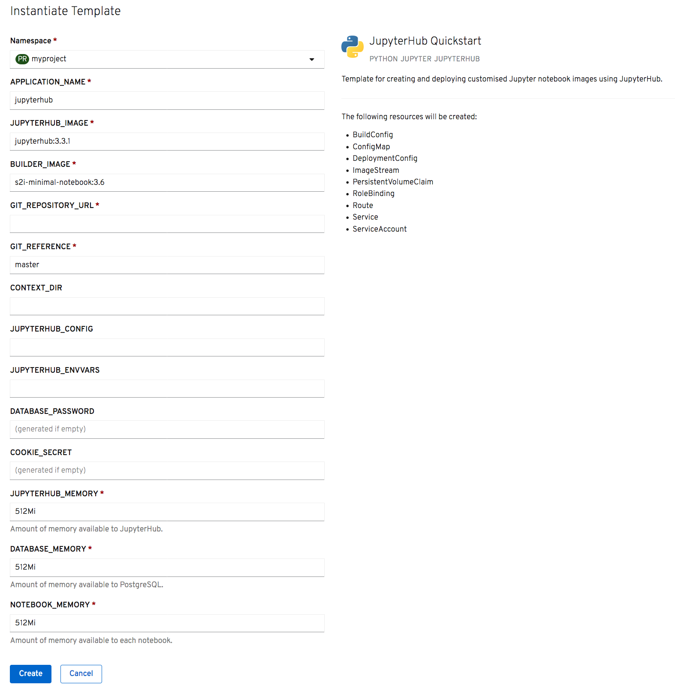

In the examples so far in this workshop, an empty Jupyter notebook image was used. It was mentioned that you could use the `notebook-builder` template to build a custom Jupyter notebook image first, and then use that when deploying the JupyterHub service.

An alternative which allows this to be done in one step, is the ``jupyterhub-quickstart`` template.

Return again to the web console, and click on _+Add_ in the left hand side menu and select _From Catalog_. In the _Developer Catalog_, enter ``jupyter``{{copy}} into the _Filter by keyword_ text entry box.

Select _JupyterHub Quickstart_ from the catalog entries shown and then _Instantiate Template_.

This combines aspects of the ``notebook-builder`` and ``jupyterhub-deployer`` templates. In this case the template parameters below relate to the building of a custom Jupyter notebook image.

* ``BUILDER_IMAGE`` - The name and version of the Jupyter notebook image to be used as the base for building the custom notebook image.
* ``GIT_REPOSITORY_URL`` - The URL to a hosted Git repository containing the Jupyter notebook files, and a Python ``requirements.txt`` file listing any Python packages required by the notebook files.
* ``GIT_REFERENCE`` - The branch of the Git repository to use.
* ``CONTEXT_DIR`` - Where files to be used to build the custom notebook image are located in a sub directory of the Git repository, the name of that sub directory.

In the list of template parameters, change the value of ``JUPYTERHUB_IMAGE`` to ``custom-jupyterhub:latest``{{copy}}. This is so we use the existing custom JupyterHub image with authentication again.

In the ``GIT_REPOSITORY_URL`` field enter the URL:

``https://github.com/jupyter-on-openshift/sample-notebooks``{{copy}}

In the ``CONTEXT_DIR`` field enter:

``matplotlib``{{copy}}

Click on _Create_ to instantiate the template. This will leave you on the _Template Instance Overview_ with details of what was created.

Two things will happen this time. The JupyterHub service will be deployed, and in parallel, the custom Jupyter notebook image will be built. Before we can access the JupyterHub service, we need to wait until the Jupyter notebook image has been built, so monitor it by running:

``oc logs -f bc/jupyterhub-nb``{{execute}}

When the build has completed, use the URL short cut icon in the _Topology_ view to access the JupyterHub service.

This time after you get past the authentication and the Jupyter notebook file browser web interface is displayed, you will see that a sample notebook file already exists for the session.
