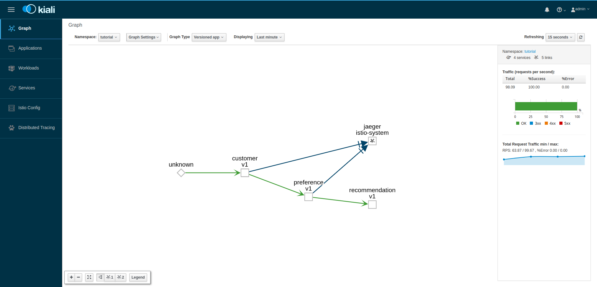
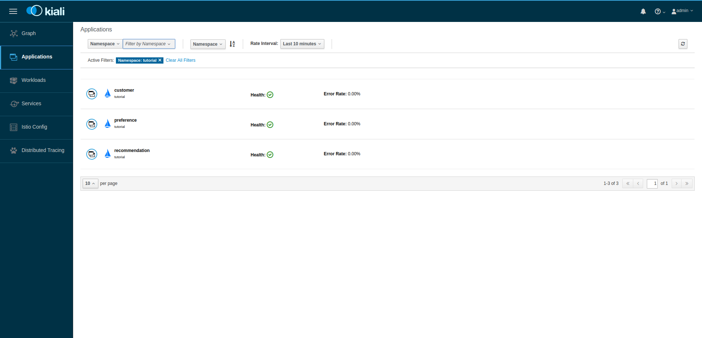
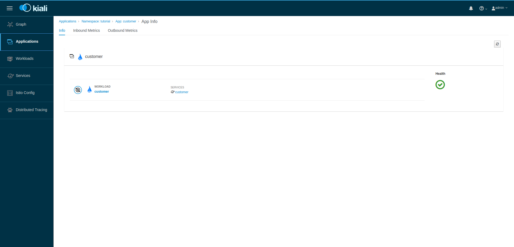
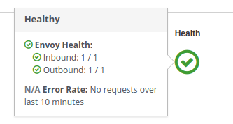
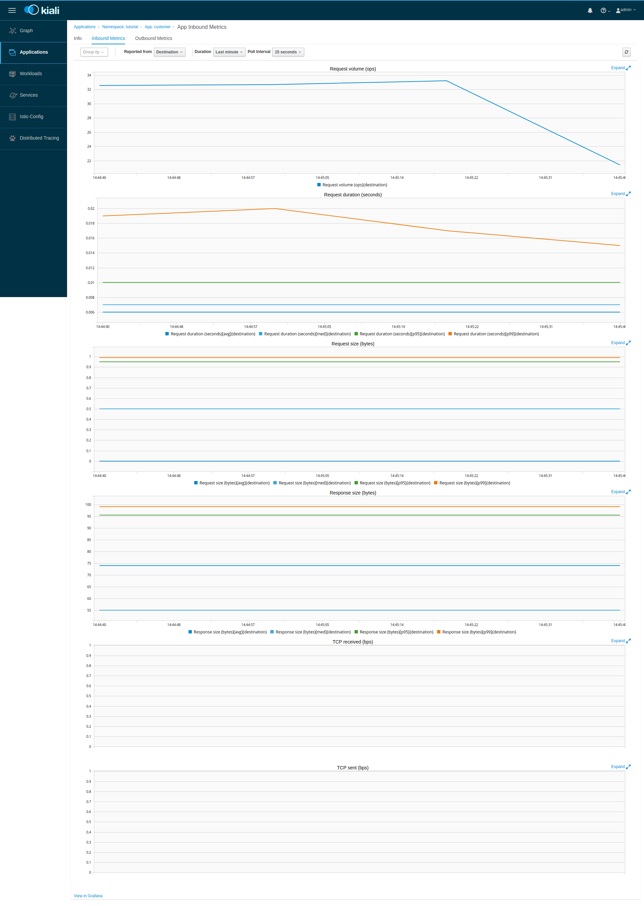
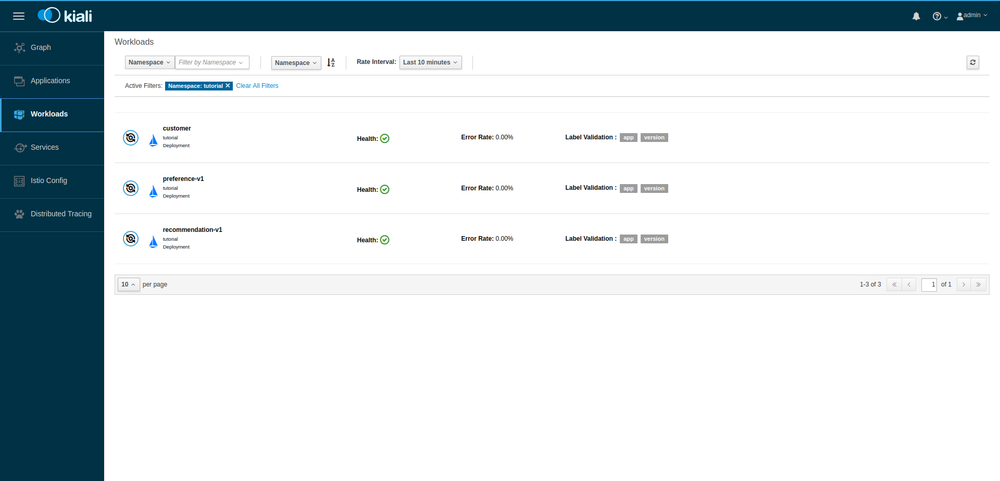
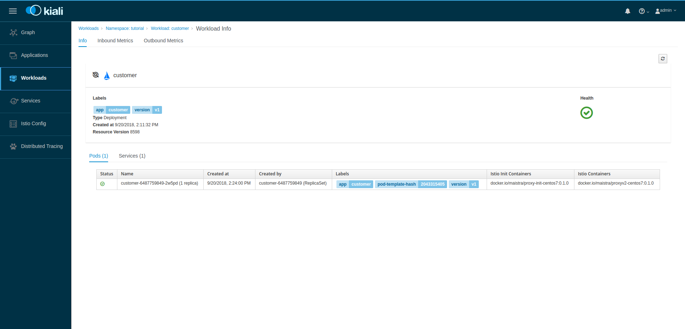
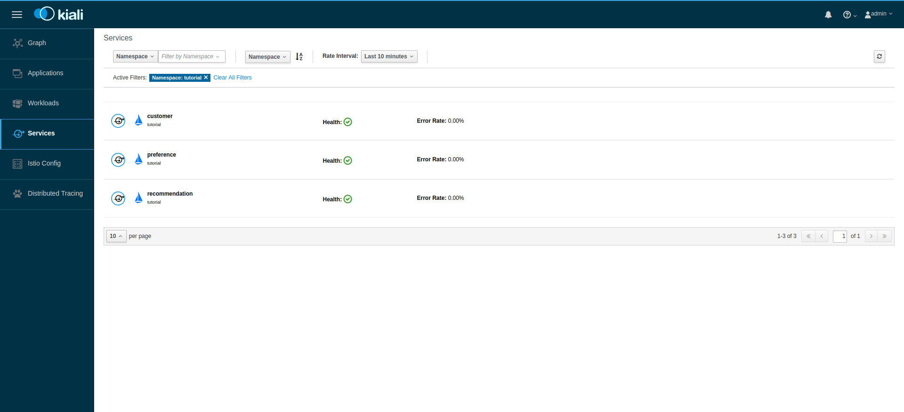
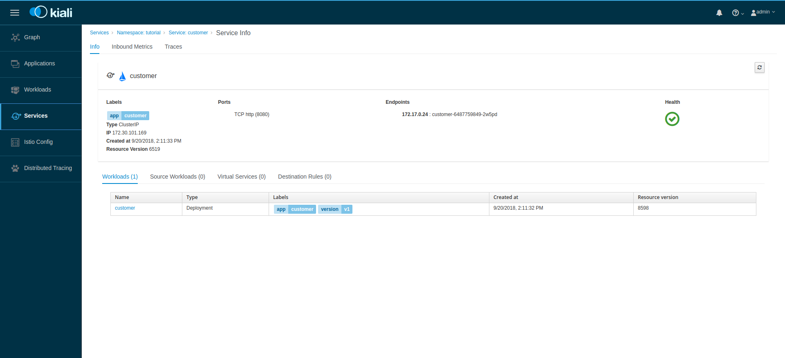
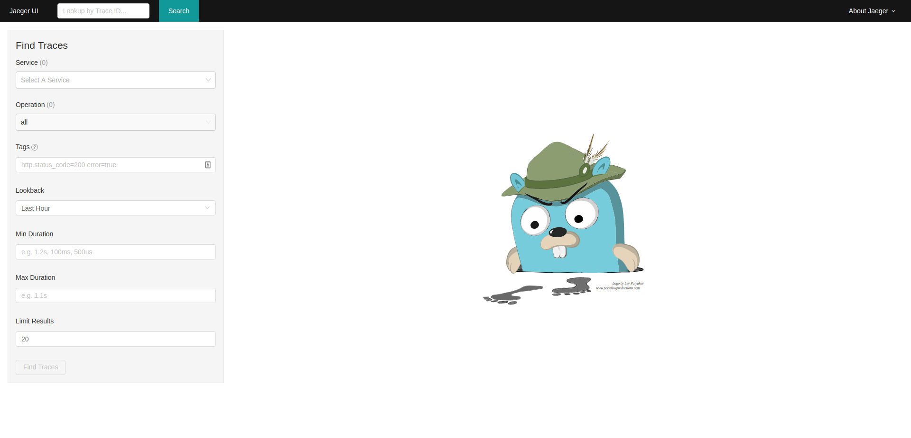

To show the capabilities of Kiali, you’ll need an Istio-enabled application to be running. For this, we can use the customer-tutorial application we created earlier.

To generate data for it, we can curl it with this command:

Execute on `Terminal 2` `while true; do curl http://customer-tutorial.[[HOST_SUBDOMAIN]]-80-[[KATACODA_HOST]].environments.katacoda.com; sleep .1; done`{{execute T2}}

## Service Graph

After you login, you should see the Service Graph page on the `Graph` menu:

Note that you might need to select the `tutorial` namespace.

It shows a graph with all the microservices, connected by the requests going through then. On this page, you can see how the services interact with each other.

## Applications

Note that you might need to select the `tutorial` namespace.

Click the `Applications` link in the left navigation. On this page you can view a listing of all the services that are running in the cluster, and additional information about them, such as health status.

Click on the "customer" application to see its details:

By hovering the icon on the Health section, you can see the health of a service (a service is considered healthy) when it’s online and responding to requests without errors:

By clicking on `Outbound Metrics or Inbound Metrics`, you can also see the metrics for an application, like so:

## Workloads

Click the `Workloads` link in the left navigation. On this page you can view a listing of all the workloads are present on your applications.

Click on the `customer` workload. Here you can see details for the workload, such as the pods and services that are included in it:

By clicking `Outbound Metrics and Inbound Metrics`, you can check the metrics for the workload. The metrics are the same as the `Application` ones.

## Services

Click on the `Services` link in the left navigation. Here, you can see the listing of all services.

Click on the `customer` service. You can, on this page, see the details of the service, such as metrics, traces, workloads, virtual services, destination rules and so on:

## Distributed Tracing

Click on the Distributed Tracing link in the left navigation. The distributed tracing, provided by Jaeger, will open in a new page.

**NOTE**: *The tracing page opens in a new browser window/tab, so if it doesn’t open, please check if your browser didn’t block it from opening.*

## Cleanup (Uninstalling Kiali)

To uninstall Kiali from your cluster, run the following command:

`oc delete all,secrets,sa,templates,configmaps,deployments,clusterroles,clusterrolebindings,virtualservices,destinationrules --selector=app=kiali -n istio-system`{{execute interrupt T1}}
