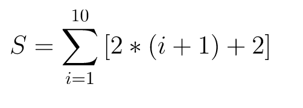

**GraalVM** поставляется с новым мощным компилятором, который называется **Graal compiler**.

## Environment Setup
> :warning: Подождите, пока **GraalVM** и **Maven 3** будут установлены в вашей среде **environment**... 

## Создайте benchmark project

Убедитесь, что **Maven** запущен и работает в вашей среде **environment**  

` mvn -version `{{execute}}

Проверить установленную версию **Java**   

` java --version `{{execute}}

Клонировать **demo repository**  
`git clone https://github.com/graalvm/graalvm-demos.git `{{execute}}

Откройте  benchmark java source `./graalvm-demos/java-simple-stream-benchmark/src/main/java/org/graalvm/demos/JavaSimpleStreamBenchmark.java`{{open}}

В этом файле мы выполняем набор потоковых операций с целыми числами для вычисления следующего **expression**

Перейти к проекту `java-simple-stream-benchmark` maven проекту  

`cd graalvm-demos/java-simple-stream-benchmark`{{execute}}

Создайте проект с помощью maven  

`mvn clean install `{{execute}}

На следующих шагах мы будем оценивать производительность этого **expression** в отношении нового JIT-компилятора GraalVM и Hotspot.

