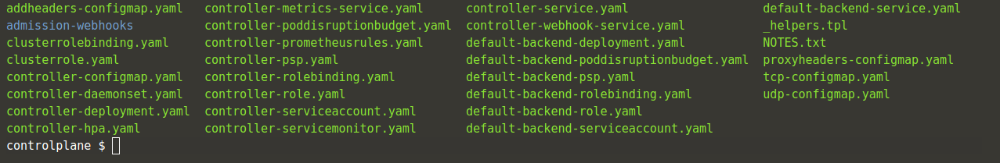

## Prerequisites
Для развертывания Ingress,

**Ingress controller** 

Возможно, нам потребуется развернуть контроллер **Ingress**, такой как **ingress-nginx**

Note : Обратите внимание, что здесь мы используем **helm** для развертывания **ingress-nginx**

Для получения дополнительной информации о **ingress-nginx**

обратитесь к [ingress-nginx](https://github.com/kubernetes/ingress-nginx/blob/master/docs/deploy/index.md#using-helm)


## Deploy ingress-nginx

Создайте пространство имен для цели установки.

`kubectl create namespace ingress-nginx`{{execute}}

CСмотрим какая версия сейчас актуальна:

`helm search hub nginx-ingress`{{execute}}

Редактируем ingress.yaml правим количество реплик например 3

`nano ingress.yaml`{{execute}}

Подготовить **Provisioning RabbitMQ** на **Kubernetes** легко, просто установите это [Helm chart](https://github.com/helm/charts/tree/master/stable/rabbitmq).
Создайте деплоймент **ingress-nginx** с помощью **helm** с помощью **command** ниже

`helm install my-ingress stable/nginx-ingress --version 1.39.1 --namespace ingress-nginx -f ingress.yaml`{{execute}}

Для запуска контейнеров **stable/nginx-ingress** требуется несколько минут. Чтобы получить полный статус обеспечения этой последовательности **provisioning this sequence**, выполните эту проверку.

`watch kubectl get deployments,pods,services --namespace ingress-nginx`{{execute}}

Через несколько секунд `pod/my-ingress-nginx-ingress-[0|1|2]` появятся и перейдут в состояние **Running**. После того, как все запущено, перестаньте **watch**. Используйте это ```clear```{{execute interrupt}} , чтобы выйти из режима наблюдения **watch**  или нажмите <kbd>Ctrl</kbd>+<kbd>C</kbd>.

# Погрузимся глубже в исследовнание манифестов **stable/nginx-ingress**

Скачаем пакет **stable/nginx-ingress**

`helm pull stable/nginx-ingress --version 1.39.1`{{execute}}
`helm pull stable/nginx-ingress --version 1.39.0`{{execute}}

`ll | grep nginx-ingress`{{execute}} 

`tar -zxvf nginx-ingress-1.39.1.tgz`{{execute}}

Смотрим Meta-данные

`cd nginx-ingress`{{execute}}

`ls`{{execute}}

`nano Chart.yaml`{{execute}}

Смотрим настройки helm

`nano values.yaml`{{execute}}

В папке templates лежат файлы **Манифестов**

`cd templates`{{execute}}

`ls`{{execute}}

Настройка манифестов

  


