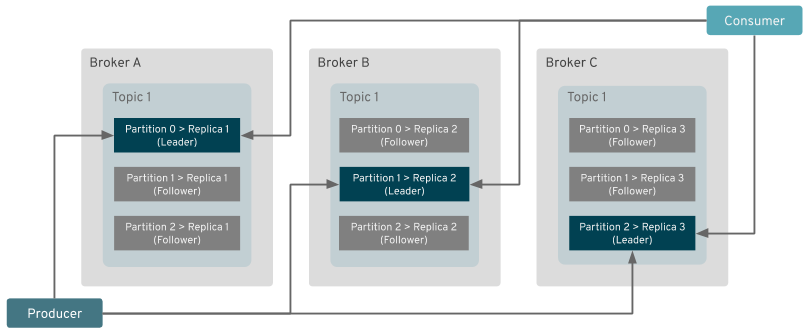
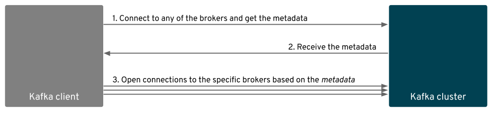

# Airflow Cluster on Kubernetes #

Как клиенты знают, где подключиться?

## Kafka’s discovery protocol

**Kafka** имеет свой собственный протокол обнаружения **discovery protocol**. Когда клиент **Kafka** подключается к кластеру **Kafka**, он сначала подключается к любому брокеру, который является членом кластера, и запрашивает у него метаданные для одной или нескольких тем **topics**. Метаданные содержат информацию о темах **topics**, их **partitions** и **brokers**, которые размещают эти **partitions**. Все брокеры должны иметь данные для всего кластера, поскольку все они синхронизируются через **Zookeeper**. Следовательно, не имеет значения, к какому брокеру клиент подключен первым - все они дадут ему одинаковый ответ.

<iframe style="width: 700px;height: 400px;" src="https://www.youtube-nocookie.com/embed/1qO2qGuJNQI" frameborder="0" allow="accelerometer; autoplay; encrypted-media; gyroscope; picture-in-picture" allowfullscreen></iframe>

**Strimzi: Apache Kafka on Kubernetes in a few minutes**

