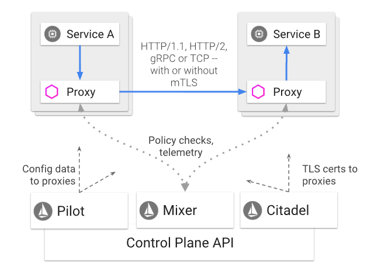
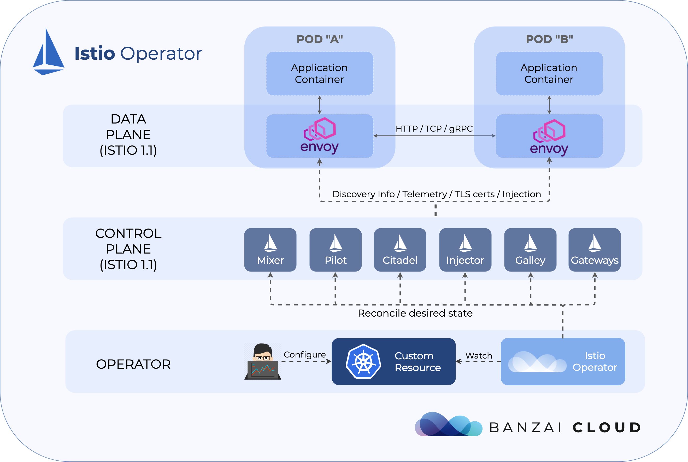

Istio service mesh логически разделена на плоскость данных **data plane** и **control plane**.

- **data plane** состоит из набора интеллектуальных прокси (**Envoy**), развернутых в виде **sidecars**. Эти прокси-серверы обеспечивают и контролируют всю сетевую связь между микросервисами, а также **Mixer**, политикой общего назначения **general-purpose policy** и центром телеметрии **telemetry hub**.
- **control plane** управляет и настраивает прокси для маршрутизации трафика **route traffic**. Кроме того, плоскость управления **control plane** настраивает микшеры **configures Mixers** для применения политик и сбора телеметрии **collect telemetry**.

Следующая диаграмма показывает различные компоненты, которые составляют каждую плоскость **each plane**:



## Istio Components

### Envoy

**Envoy** - это **high-performance proxy** разработанный на C ++ для передачи всего входящего и исходящего трафика для всех сервисов в **service mesh**. 
**Istio** использует многие встроенные функции **Envoy**, например:

- **Dynamic service discovery**
- **Load balancing**
- **TLS termination**
- **HTTP/2 and gRPC proxies**
- **Circuit breakers**
- **Health checks**
- **Staged rollouts with %-based traffic split**
- **Fault injection**
- **Rich metrics**

**Envoy** заДеплоин как **sidecar** для соответствующей службы в том же **Kubernetes pod**. Такое развертывание позволяет **Istio** извлекать множество сигналов о поведении трафика **traffic behavior** в качестве атрибутов **attributes**. **Istio**, в свою очередь, может использовать эти атрибуты в **Mixer** для принудительного принятия политических решений **enforce policy decisions** и отправлять их в системы мониторинга для предоставления информации о поведении **behavior** всей **service mesh**.

### Mixer

**Mixer** - это независимый от платформы компонент. **Mixer** обеспечивает контроль доступа и политики использования в **service mesh** и собирает данные телеметрии из прокси-сервера **Envoy** и других служб. Прокси-сервер извлекает атрибуты уровня запроса **request level attributes** и отправляет их в **Mixer** для оценки.

**Mixer** включает в себя гибкий плагин модели **flexible plugin model**. Эта модель позволяет **Istio** взаимодействовать с различными **host environments** и бэкэндами инфраструктуры. Таким образом, **Istio** абстрагирует прокси-сервер** Envoy** и **Istio-managed services** от этих деталей.

### Pilot

**Pilot** обеспечивает **service discovery** для **Envoy sidecars**, возможности управления трафиком для интеллектуальной маршрутизации **intelligent routing** (например,  **A/B tests**, **canary deployments**, **etc.**)) и отказоустойчивость **resiliency**  (**timeouts**, **retries**, **circuit breakers**, **etc.**).

**Pilot** преобразует правила маршрутизации высокого уровня **high level routing rules**,  которые управляют поведением трафика **traffic behavior**, в **Envoy-specific configurations** и распространяет их на **sidecars** во время выполнения. **Pilot** абстрагирует механизмы обнаружения сервисов **service discovery** для конкретной платформы и синтезирует их в стандартный формат, может потребляться любой **sidecar**, соответствующая API-интерфейсам плоскости данных **Envoy data plane APIs**.

Эта слабая связь позволяет **Istio** работать в нескольких средах **multiple environments**, таких как **Kubernetes**, **Consul** или **Nomad**, сохраняя при этом тот же интерфейс **operator interface** для управления трафиком **traffic management**.

### Citadel

**Citadel** обеспечивает надежную аутентификацию между сервисами **service-to-service** и конечными пользователями со встроенной идентификацией и управлением учетными данными **credential management**. Вы можете использовать **Citadel** для обновления незашифрованного трафика в сервисной сетке. Используя **Citadel**, операторы - **operators** могут применять политики на основе **service identity**, а не на элементах управления сетью.



https://github.com/banzaicloud/istio-operator

### Пример кода **Istio operator** для **banzaicloud**

Istio-operator - оператор Kubernetes для развертывания и управления ресурсами Istio для кластера Kubernetes.
```
git clone git@github.com:banzaicloud/istio-operator.git
git checkout release-1.1
```

Установка  **Operator**  в **banzaicloud** c помощью **Helm**

```
helm repo add banzaicloud-stable http://kubernetes-charts.banzaicloud.com/branch/master

helm install --name=istio-operator --namespace=istio-system banzaicloud-stable/istio-operator
```

### Пример кода **Istio operator**

https://github.com/istio/operator

https://github.com/maistra/istio-operator