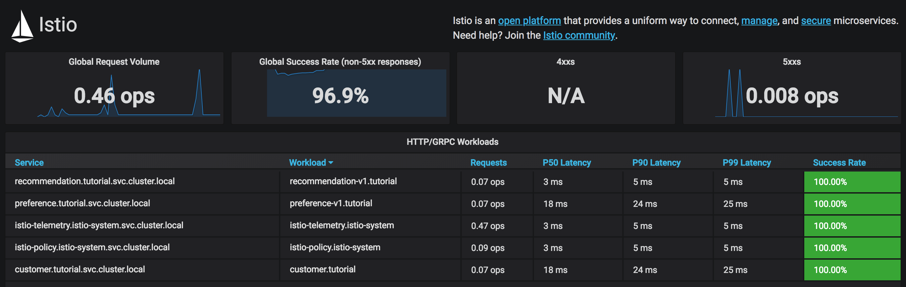
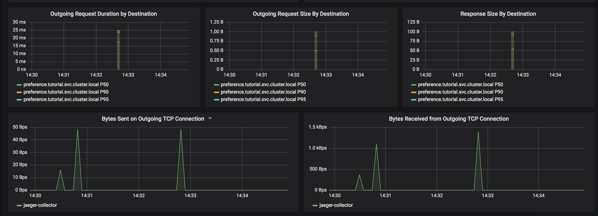

For monitoring, Istio offers out of the box monitoring via Prometheus and Grafana.

Для мониторинга **Istio** предлагает готовый мониторинг из коробки через **Prometheus** и **Grafana**.

**Note:** Прежде чем мы взглянем на **Grafana**, нам нужно отправить несколько запросов нашему приложению, используя **`Terminal 2`**: 

`while true; do curl http://customer-tutorial.[[HOST_SUBDOMAIN]]-80-[[KATACODA_HOST]].environments.katacoda.com; sleep .2; done`{{execute T2}}

Проверьте есть ли **`grafana`** route, набрав:

`oc get route -n istio-system`{{execute interrupt T1}}

Проверьте версию **istio**, набрав:

`istioctl version`{{execute interrupt T1}}

##   Установим Istio-1.6.8

Запустите установку **Istio-1.6.8**

`/usr/local/bin/istio-install.sh`{{execute T1}}

Примечание: если вас как-то смущает `error: taint "node-role.kubernetes.io/master" not found`, проигнорируйте это сообщение пожалуйста, оно ни на что не влияет.

Проверьте, что все поды Istio в состоянии Running `kubectl get pods -n istio-system`{{execute T1}}

Теперь, когда вы знаете URL-адрес **`Grafana`**, откройте его по адресу 

http://grafana-istio-system.[[HOST_SUBDOMAIN]]-80-[[KATACODA_HOST]].environments.katacoda.com/d/1/istio-dashboard?refresh=5s&orgId=1

Вы также можете проверить загруженность **services** 

http://grafana-istio-system.[[HOST_SUBDOMAIN]]-80-[[KATACODA_HOST]].environments.katacoda.com/d/UbsSZTDik/istio-workload-dashboard?refresh=5s&orgId=1

