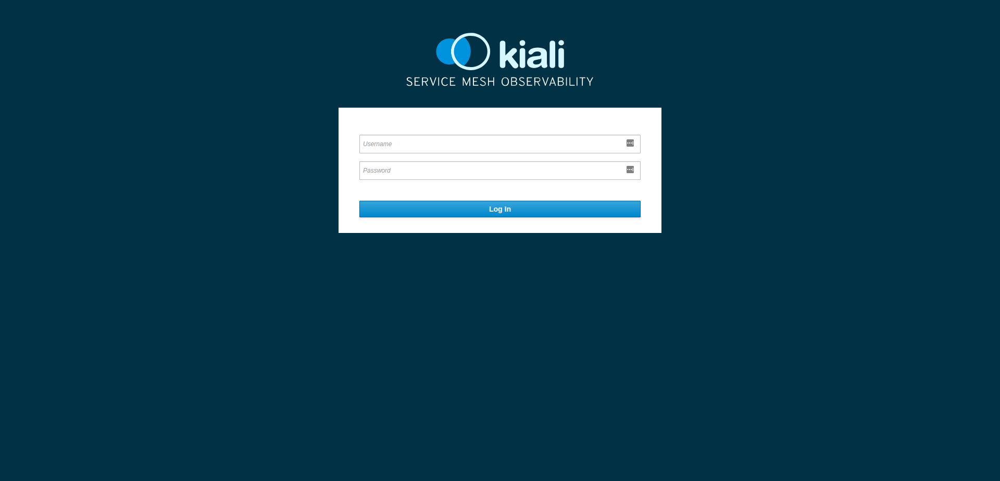

Используйте следующую команду для просмотра дополнительной информации о **`istioctl`**:

`istioctl version`{{execute}}

Установите **Kiali** с помощью следующих команд:

- Определите URL-адреса для **Jaeger** и **Grafana**

`export JAEGER_URL="https://tracing-istio-system.[[HOST_SUBDOMAIN]]-80-[[KATACODA_HOST]].environments.katacoda.com"; \
export GRAFANA_URL="https://grafana-istio-system.[[HOST_SUBDOMAIN]]-80-[[KATACODA_HOST]].environments.katacoda.com"; \
export VERSION_LABEL="v0.9.0"`{{execute T1}}

- Инсталлируйте **Kiali's configmap**

`curl https://raw.githubusercontent.com/kiali/kiali/${VERSION_LABEL}/deploy/openshift/kiali-configmap.yaml | \
  VERSION_LABEL=${VERSION_LABEL} \
  JAEGER_URL=${JAEGER_URL}  \
  GRAFANA_URL=${GRAFANA_URL} envsubst | oc create -n istio-system -f -`{{execute T1}}
  
- Инсталлируйте **Kiali's secrets**

`curl https://raw.githubusercontent.com/kiali/kiali/${VERSION_LABEL}/deploy/openshift/kiali-secrets.yaml | \
  VERSION_LABEL=${VERSION_LABEL} envsubst | oc create -n istio-system -f -`{{execute T1}}
  
- Задеплойте **Kiali** в кластер

`curl https://raw.githubusercontent.com/kiali/kiali/${VERSION_LABEL}/deploy/openshift/kiali.yaml | \
  VERSION_LABEL=${VERSION_LABEL}  \
  IMAGE_NAME=kiali/kiali \
  IMAGE_VERSION=${VERSION_LABEL}  \
  NAMESPACE=istio-system  \
  VERBOSE_MODE=4  \
  IMAGE_PULL_POLICY_TOKEN="imagePullPolicy: Always" envsubst | oc create -n istio-system -f -`{{execute T1}}
  
- Создайте новый **Route** для порта **443**

`(oc get route kiali -n istio-system -o json|sed 's/80/443/')|oc apply -n istio-system -f -`{{execute T1}}
  
Инсталяция **Kiali** может занять минуту или две. Вы можете использовать следующие команды, чтобы проверить, запущен ли **service**:
 `oc get pods -w -n istio-system`{{execute T1}}

Подождите, пока состояние **Kiali** не будет в статусе **"Running"** и в столбце **"Ready"** будет 1/1 **pods**. Чтобы выйти, нажмите **Ctrl+C**.

Итак, теперь мы можем получить доступ к **Kiali** по адресу http://kiali-istio-system.[[HOST_SUBDOMAIN]]-443-[[KATACODA_HOST]].environments.katacoda.com

Учетные данные по умолчанию **"admin/admin"**, но рекомендуется изменить их перед использованием в **production** среде.
