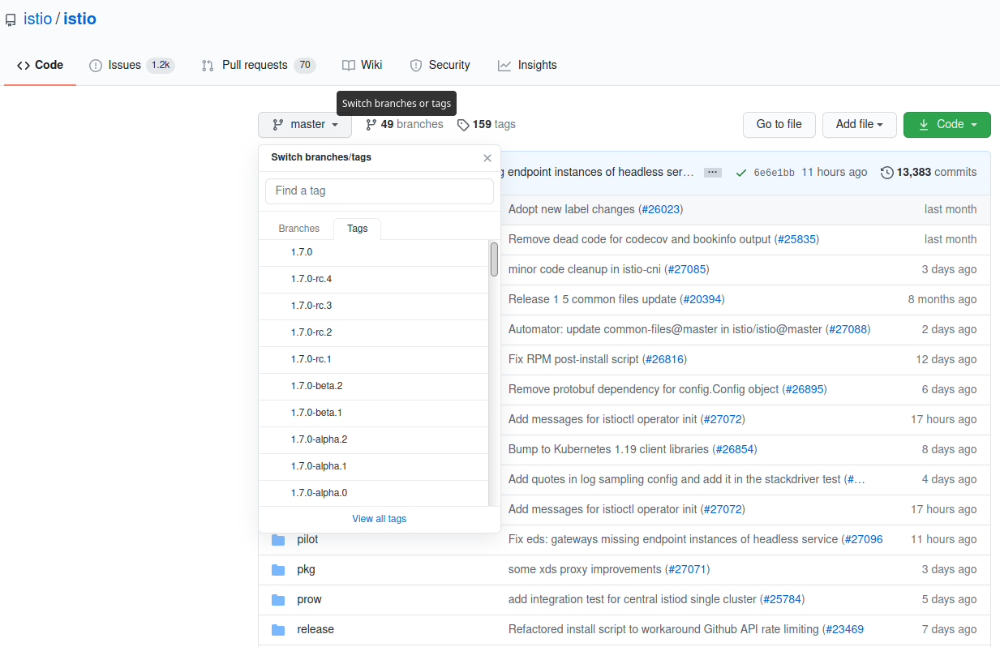

## Kubernetes

Дождитесь подтверждения запуска кластера в терминале, должно появиться такое сообщение

```
master $ launch.sh
Waiting for Kubernetes to start...
Kubernetes started
```

Убедитесь, что все поды находятстя в состоянии Running прежде чем двигаться дальше `kubectl get pods --all-namespaces`{{execute T1}}

Исключение может быть сделано для katacoda-cloud-provider он может остаться в статусе CrashLoopBackOff, что никак не влияет на дальнейшие шаги

## Istio



Запустите установку istio `/usr/local/bin/istio-install.sh`{{execute T1}}

Примечание: если вас как-то смущает `error: taint "node-role.kubernetes.io/master" not found`, проигнорируйте это сообщение пожалуйста, оно ни на что не влияет.

Проверьте, что все поды Istio в состоянии Running `kubectl get pods -n istio-system`{{execute T1}}

### Проверьте, что установлено
https://istio.io/latest/docs/setup/install/istioctl/

Команда **istioctl** сохраняет **IstioOperator CR**, который использовался для установки Istio, в копию CR с именем **installed-state**. Вместо проверки развертываний, модулей, служб и других ресурсов, установленных **Istio**, например:

`kubectl -n istio-system get deploy`{{execute T1}}

Вы можете проверить **installed-state CR**, чтобы увидеть, что установлено в кластере, а также все пользовательские настройки. Например, выгрузите содержимое **installed-state** в файл YAML, используя следующую команду:

`kubectl -n istio-system get IstioOperator installed-state -o yaml > installed-state.yaml`{{execute T1}}

**installed-state CR** состояния также используется для выполнения проверок в некоторых командах **istioctl**, поэтому его не следует удалять.

### Customize Istio settings using the Helm API

The IstioOperator API includes a pass-through interface to the Helm API using the values field.

The following YAML file configures global and Pilot settings through the Helm API:
```
apiVersion: install.istio.io/v1alpha1
kind: IstioOperator
spec:
  values:
    pilot:
      traceSampling: 0.1 # override from 1.0
    global:
      monitoringPort: 15050
```

Some parameters will temporarily exist in both the Helm and IstioOperator APIs, including Kubernetes resources, namespaces and enablement settings. The Istio community recommends using the IstioOperator API as it is more consistent, is validated, and follows the community graduation process.
