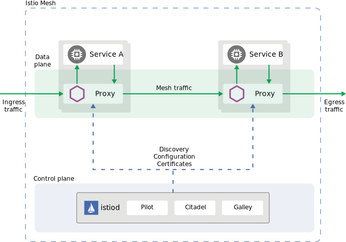

The previous step deployed the Istio components in two planes.

## Data Plane

This data plane where your application services connect. At this level the Envoy container is injected into select Pods to take over all inbound and outbound (ingress/egress) Pod traffic. Since each Pod has a virtual IP, the Envoy can insert itself via the routing table. Each Envoy is continuously synched with the rules of the mesh to control a Pods traffic routing, traffic security (e.g. mutual TLS), and gather metrics, logging, and tracing. The Envoy proxies form a secure microservice mesh providing a rich set of functions like discovery, rich layer-7 routing, circuit breakers, policy enforcement and telemetry recording/reporting functions.

## Control Plane

The entire mesh is managed a few processes bundled into the Istiod binary. On Kubernetes, Istiod is packaged in a container and runs in Pod. Within Istiod are three main control plane components. These component used to be separate Pods, but have been recently consolidated into a single Istiod process. The primary controls that constitute the control plane are:

- **Pilot** Pilot is responsible for the lifecycle of Envoy instances deployed across the Istio service mesh. The Envoy shepherd. It exposes the Istio Rules API to allow you to configure the mesh. The Pilot synchronizes the meshing rules to the Envoys throughout the mesh.

- **Citadel** All communication governed by the mesh can be encrypted over TLS. The keys and certificates of Istio workloads are generated, distributed, rotated and revoked by Citadel. The security information is distributed to the Envoy sidecars through ephemeral secret-volume mounted files and retained in Envoy memory. While the Citadel is assumed to be the default certificate authority, it can be extended to connect to other authorities with an enabled secret discovery service (SDS). All communication can be encrypted with mutual TLS in your cluster using the mesh. This can help meet many of your security requirements and regulatory validations.

- **Galley** The top-level config ingestion, processing and distribution component of Istio. It is responsible for insulating the rest of the Istio components from the details of obtaining user configuration from the underlying platform. It contains Kubernetes CRD listeners for collecting configuration, an MCP protocol server implementation for distributing config, and a validation web-hook for pre-ingestion validation by Kubernetes API Server.

More about the [Istio architecture is here](https://istio.io/latest/docs/ops/deployment/architecture/).

