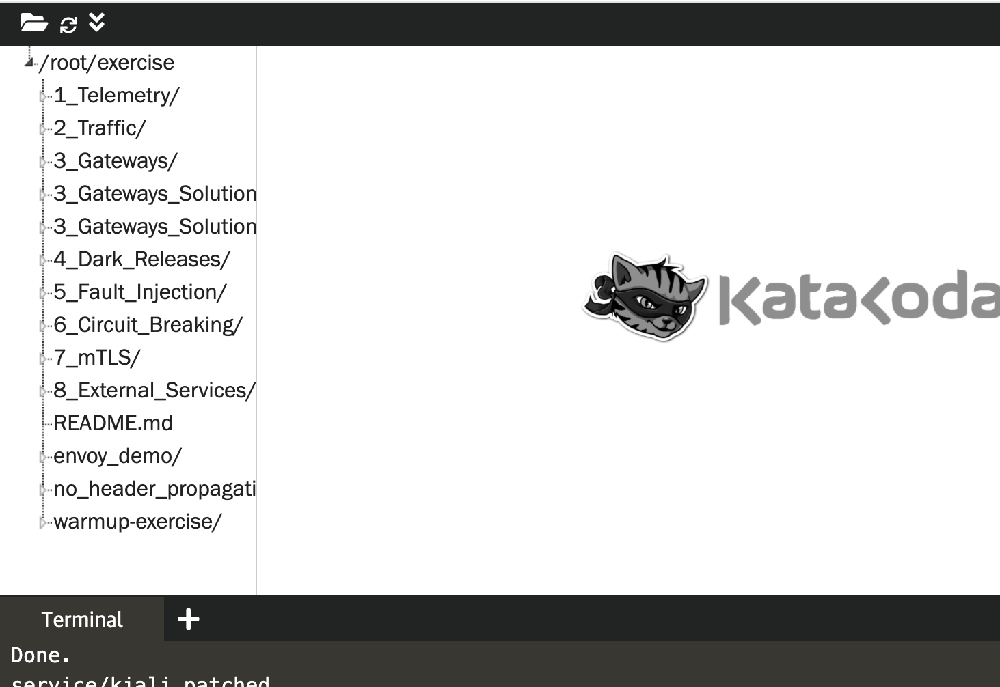

Для успешного прохождения модуля проверьте, что вам доступны все необходимые инструменты и учебные примеры. 

## Инструменты

1. Kiali https://[[HOST_SUBDOMAIN]]-31546-[[KATACODA_HOST]].environments.katacoda.com/

    1. Логин: admin
    1. Пароль: admin

1. Jaeger https://[[HOST_SUBDOMAIN]]-31547-[[KATACODA_HOST]].environments.katacoda.com/
1. Grafana https://[[HOST_SUBDOMAIN]]-31548-[[KATACODA_HOST]].environments.katacoda.com/

Убедитесь, что все указанные ссылки открываются, они вам понядобятся в дальнейшем.

## Скачайте учебные примеры

`git clone https://github.com/webngt/istio-handson.git /root/exercise`{{execute T1}}

Список каталогов с исходники учебных примеров вы сможете найти используя терминал, выполнив команду `ls /root/exercise/`{{execute T1}}

Также список примеров доступен в дереве редактора

## TroubleShoot

Если что-то пошло не так:

* перезагрузите страницу упражнения и начните сценарий заново.
