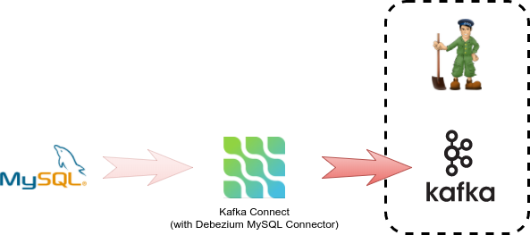

**Развертывание Kafka Connect с Debezium**

Мы собираемся использовать функцию двоичной сборки [binary build](https://docs.openshift.org/latest/dev_guide/dev_tutorials/binary_builds.html) **OpenShift** вместе с дистрибьюцией плагина [distribution](http://central.maven.org/maven2/io/debezium/debezium-connector-mysql/0.10.0.Final/) для **MySql** [plugin](http://debezium.io/docs/connectors/mysql/) деплоя узла **Kafka Connect node** со встроенным плагином **Debezium MySQL**.

**1. Развернуть пустой Kafka Connect node**

Мы снова будем использовать [template](https://raw.githubusercontent.com/strimzi/strimzi/master/examples/templates/cluster-controller/connect-s2i-template.yaml) из проекта **Strimzi**, который уже установлен в окружающая **environment**.  from Strimzi project that is already installed in the environment.
Как и в случае с брокером **Kafka broker**, нам необходимо настроить **template** для поддержки развертывания только для одного экземпляра **single-instance-only deployment**.  

``oc new-app strimzi-connect-s2i -p KAFKA_CONNECT_CONFIG_STORAGE_REPLICATION_FACTOR=1 -p KAFKA_CONNECT_OFFSET_STORAGE_REPLICATION_FACTOR=1 -p KAFKA_CONNECT_STATUS_STORAGE_REPLICATION_FACTOR=1``{{execute}}

Новая конфигурация сборки будет создана  

``oc get bc``{{execute}}

    NAME                         TYPE      FROM      LATEST
    my-connect-cluster-connect   Source    Binary    1

и новый **service** будет развернут.

``oc get svc -l app=strimzi-connect-s2i``{{execute}}

    NAME                             TYPE        CLUSTER-IP      EXTERNAL-IP   PORT(S)    AGE
    my-connect-cluster-connect-api   ClusterIP   172.30.89.106   <none>        8083/TCP   11s

**2. Embed Debezium into Connect**

Мы будем использовать двоичную сборку для создания **Connect node** с плагином **Debezium plugin** внутри

``oc start-build my-connect-cluster-connect --from-archive https://repo.maven.apache.org/maven2/io/debezium/debezium-connector-mysql/1.1.1.Final/debezium-connector-mysql-1.1.1.Final-plugin.tar.gz --follow``{{execute}}

**Connect node** должен быть повторно **redeployed** после завершения сборки **build completes**

``oc get pods -w -l app=strimzi-connect-s2i``{{execute}}

    NAME                                 READY     STATUS        RESTARTS   AGE
    my-connect-cluster-connect-1-wktnt   0/1       Terminating   0          50s
    my-connect-cluster-connect-2-lqqht   0/1       Running       0          26s

**3. Verify - убедитесь, что Connect подключен и содержит Debezium**

Подождите, пока **Connect node** не будет готов

    NAME                                 READY     STATUS    RESTARTS   AGE
    my-connect-cluster-connect-2-lpnd2   1/1       Running   0          1m

и список всех плагинов, доступных для использования.

``oc exec -c kafka my-cluster-kafka-0 -- curl -s http://my-connect-cluster-connect-api:8083/connector-plugins``{{execute}}

    [
        {"class":"io.debezium.connector.mysql.MySqlConnector","type":"source","version":"0.10.0.Final"},
        {"class":"org.apache.kafka.connect.file.FileStreamSinkConnector","type":"sink","version":"2.3.0"},
        {"class":"org.apache.kafka.connect.file.FileStreamSourceConnector","type":"source","version":"2.3.0"}
    ]

На **Connect node** доступен подключаемый модуль **Debezium** `MySqlConnector` **connector** .

## Поздравляю

Вы успешно выполнили второй шаг в этом сценарии.. 

Вы успешно развернули узел **Kafka Connect** и настроили его на использование **Debezium**.

На следующем этапе этого сценария мы закончим развертывание, создав соединение между источником базы данных и **Kafka Connect**

