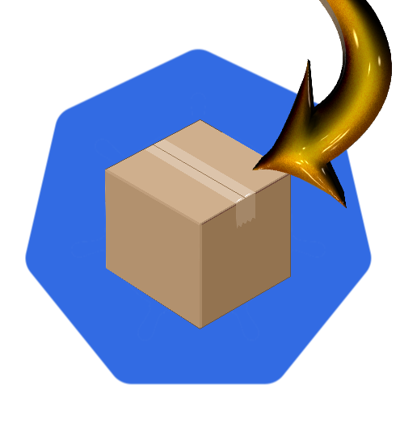

# Pod Presets #

Pod Presets is a construct that was added in Kubernetes v1.10.

> PodPresets are evaluated by another admission controller, which helps inject fields specified in a matching PodPreset into Pods at creation time. The fields can include volumes, volume mounts, or environment variables. Thus, PodPresets inject additional runtime requirements into a Pod at creation time using label selectors to specify the Pods to which a given PodPreset applies. PodPresets allow Pod template authors to automate adding repetitive information required for multiple Pods. -- Kubernetes Patterns, Roland Huß; Bilgin Ibryam, O'Reilly Media, Inc., 2019

A pod preset is an object that injects user-specified information into pods as they are created.

These types of configurations can be injected into a Pod:

- Secret objects
- ConfigMap objects
- storage volumes
- container volume mounts
- environment variables

PodPresets allow Pod template authors to automate adding repetitive information required for multiple Pods.

PodPreset: PodPresets allows setting a template for your pods. Upon pod creation, the controller iterates over all PodPresets and if your pod matches, the preset is applied to your pod. It can be useful to provide a baseline for all pods or attaching specific ConfigMap or Volumes to pods.

When the Pod labels match an existing PodPreset with a matching label selector then preset values are injected into the Pod. One or more PodPresets can be matched to a Pod, as long as the values injected do not collide.
Q: Is the order of definition important?  Shouldn't be.

You can exclude specific pods from being injected using the podpreset.admission.kubernetes.io/exclude: "true".

In the following steps you will learn how:

- to ...
- to ...

The Pod Preset feature is described in the [Kubernetes documentation](https://kubernetes.io/docs/tasks/inject-data-application/podpreset/). More references to documentation is listed at the end of this scenario.
