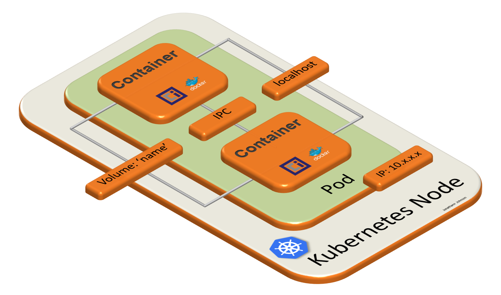

Containers in the same Pod have several advantages. Primarily these colocated containers benefit from fast communication channels between each other. The transmission of data use the [established Linux inter-process communication (IPC) techniques](https://www.tldp.org/LDP/tlk/ipc/ipc.html):

- Signals
- Pipes
- Sockets
- Message queues
- Semaphores
- Shared memory

Often direct communication via localhost or through shared file mounts provide fast and reliable communication, avoiding the fallacies of distributed computing.

Sidecars are a common pattern that takes advantage of the fact that two containers in a Pod share the same Linux process namespaces. Sidecar containers often share:

- PersistenceVolume mount: "emptyDir"
- localhost

Let's deploy a Pod with this sidecar pattern.