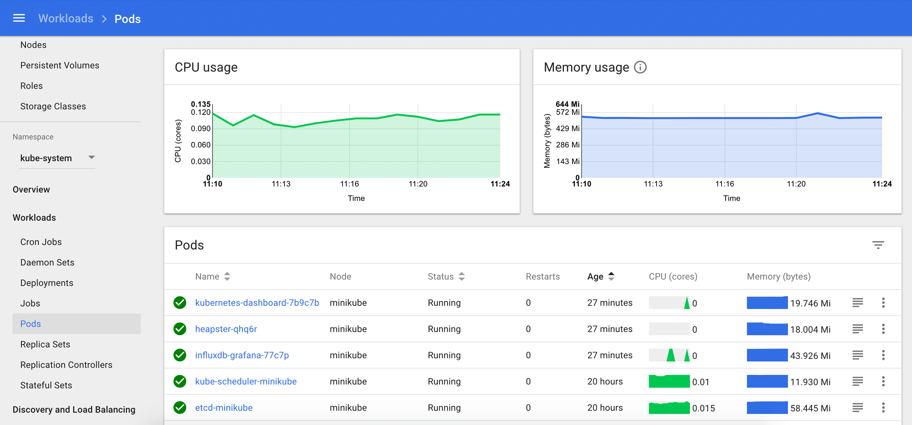

Для этого сценария **Katacoda** только что запустила новый кластер **Kubernetes** для вас. Убедитесь, что он готов к использованию.

`kubectl version --short && \
kubectl get componentstatus && \
kubectl get nodes && \
kubectl cluster-info`{{execute}}

Также доступен менеджер пакетов [Helm](https://helm.sh/), используемый для установки приложений в **Kubernetes**.

`helm version --short`{{execute}}

## Kubernetes Dashboard ##

Вы можете администрировать свой кластер с помощью инструмента CLI `kubectl` или использовать визуальную панель управления **Kubernetes Dashboard**. Используйте этот скрипт для доступа к защищенной панели инструментов **Dashboard**.

`token.sh`{{execute}}

## Делой приложения ##

`helm repo list`{{execute}}

Поиск чарта **kube-ops**

`helm search hub kube-ops`{{execute}}

У каждого чарта есть **values**

`helm show values stable/kube-ops-view`{{execute}}

отправил вывод **stdout** от **helm show** в **values.yaml**

`helm show values stable/kube-ops-view > values.yaml`{{execute}}

`helm install ops-view stable/kube-ops-view --namespace=kube-system -f values.yaml`{{execute}}

Для запуска контейнеров **kube-ops-view** требуется несколько минут. Чтобы получить полный статус **provisioning** этой последовательности, выполните эту проверку.

`watch kubectl get deployments,pods,services --namespace kube-system`{{execute}}

## Kubernetes Dashboard

Как администратор, вы можете управлять кластером с помощью инструмента CLI **kubectl**. Вы также можете использовать панель управления **Kubernetes Dashboard**. Поскольку к инструментальной панели **dashboard** можно получить общий доступ, она защищена и для входа требуется **secret access token**. Поскольку у вас есть административный доступ к этому кластеру, скопируйте **token** из этого секрета.

`echo -e "\n--- Copy and paste this token for dashboard access ---" && kubectl describe secret $(kubectl get secret | awk '/^dashboard-token-/{print $1}') | awk '$1=="token:"{print $2}' && echo "---"`{{execute}}

Чтобы получить доступ к панели инструментов **dashboard**, кликните вкладку **Kubernetes Dashboard** над командной строкой или перейдите по этой ссылке: https://[[HOST_SUBDOMAIN]]-30000-[[KATACODA_HOST]].environments.katacoda.com/. В приглашении для входа выберите **Token** и вставьте **токен**, который вы скопировали минуту назад.

