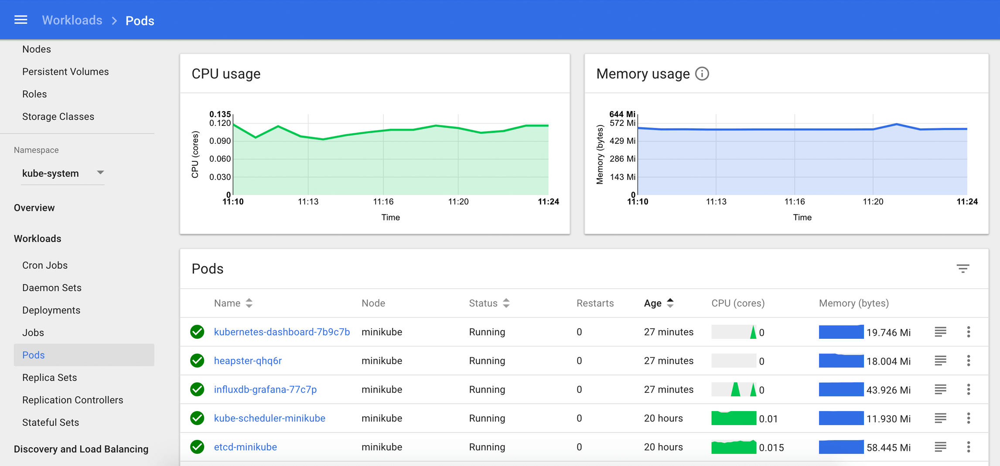

В этом сценарии, через пару минут **Katacoda** запустит для вас новый кластер **Kubernetes**.  
**Подождите пару минут**.  
Убедитесь, что кластер готов к использованию.  

`kubectl version --short && \
kubectl get componentstatus && \
kubectl get nodes && \
kubectl cluster-info`{{execute}}

Также доступен менеджер пакетов [Helm](https://helm.sh/), используемый **helm** для инсталлйции приложений в **Kubernetes**.

`helm version --short`{{execute}}

## Kubernetes Dashboard ##

Вы можете администрировать свой кластер с помощью **CLI tool** инструмента командной строки **`kubectl`** и использовать визуальную панель **Kubernetes Dashboard**. Используйте этот скрипт для доступа к защищенной панели инструментов **Kubernetes Dashboard**.

`token.sh`{{execute}}
