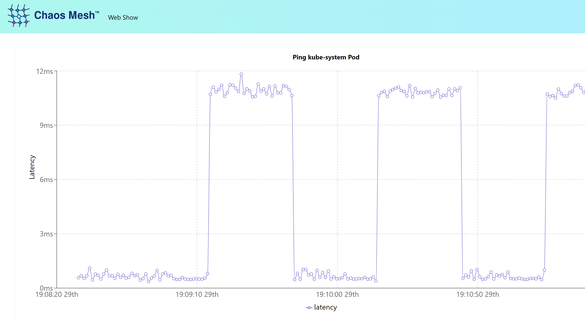

Ваш первый эксперимент применит к приложению **network delay** сетевую задержку.

## Инсталлируйте пример Web-show приложения 

Инсталлируйте пример приложения в качестве цели для эксперимента. Это приложение разработано проектом **Chaos Mesh** как пример **_hello world_** для вашего первого эксперимента. Предоставляются **YAML** для развертывания и обслуживания. Приложению требуется переменная среды для **TARGET_IP**, который является **IP-адресом** кластера, поэтому этот контекст вы предоставляете как **ConfigMap**. Эта переменная **ConfigMap** упоминается в **Deployment YAML**.

Создайте **ConfigMap** с контекстом **IP context**:

`TARGET_IP=$(kubectl get pod -n kube-system -o wide| grep kube-controller | head -n 1 | awk '{print $6}')`{{execute}}

`kubectl create configmap web-show-context --from-literal=target.ip=${TARGET_IP}`{{execute}}

Примените декларации **declarations** о развертывании для **Deployment и Service**:

`kubectl apply -f web-show-deployment.yaml`{{execute}}

`kubectl apply -f web-show-service.yaml`{{execute}}

Для начала потребуется некоторое время. Вы можете увидеть статус приложения в пространстве имен по умолчанию **default namespace**:

`kubectl get deployments,pods,services`{{execute}}

При запущенном приложении **web-show** к его **web interface** можно получить доступ из **"Web Show"** над областью командной строки или по этой ссылке: https://[[HOST_SUBDOMAIN]]-30081-[[KATACODA_HOST]].environments.katacoda.com/.

## Define Experiment

The Chaos Mesh has installed several custom resources:

`kubectl get crds`{{execute}}

You can reference these resources to create declarative YAML manifests that define your experiment. For your first experiment, you will impose a _network delay_. The delay is defined in the _NetworkChaos_ manifest this way:

`ccat network-delay-experiment.yaml`{{execute}}

The experiment declares that a 10ms network delay should be injected every minute that lasts for 30 seconds. The delay will only be applied to the target service labeled "app": "web-show". This is the _blast radius_. Only the web-show app has that label:

`kubectl get deployments,pods -l app='web-show'`{{execute}}

## Apply Experiment

Because the Chaos Mesh follows the Kubernetes Operator pattern with CRDs, the experiment can be applied like any other Kubernetes object.

`kubectl apply -f network-delay-experiment.yaml`{{execute}}

The experiment is now running.

`kubectl get NetworkChaos`{{execute}}

## Observe

Access the [web-show application](https://[[HOST_SUBDOMAIN]]-30081-[[KATACODA_HOST]].environments.katacoda.com/.
) (or use the tab). The application has a built-in graph that will show the latency it's experiencing. With the experiment applied you will see the 10ms delay every 30 seconds. Look at the dashboard, find the experiment, and drill down on its details.

## Update Experiment

At any time you can change the YAML declaration and apply further experiment updates with:

`kubectl apply -f network-delay-experiment.yaml`{{execute}}

The experiment can be paused:

`kubectl annotate networkchaos web-show-network-delay experiment.chaos-mesh.org/pause=true`{{execute}}

and resumed:

`kubectl annotate networkchaos web-show-network-delay experiment.chaos-mesh.org/pause-`{{execute}}

Since the NetworkChaos is like any other Kubernetes resource, the experiment can be easily removed.

`kubectl delete -f network-delay-experiment.yaml`{{execute}}
