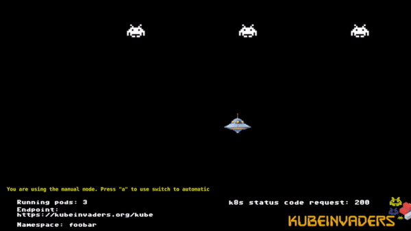

# KubeInvaders on Kubernetes #

> Adopting chaos engineering strategies for your production environment is useful, because it is the only way to test if a system supports unexpected destructive events.

KubeInvaders is a lighthearted gamified way of learning chaos engineering on Kubernetes. It's like Space Invaders but the aliens are the Pods. The game was created by **[Eugenio Marzo](https://www.linkedin.com/in/eugenio-marzo-646a6742/?originalSubdomain=it)**.

You will learn how:

- to install KubeInvaders onto Kubernetes
- to play!
- to experiment with Pods and resilience

Eugenio Marzo offers a [blog entry on the game](https://devopstribe.it/) and it has been featured on the [Kubernetes blog](https://kubernetes.io/blog/2020/01/22/kubeinvaders-gamified-chaos-engineering-tool-for-kubernetes/). This Katacoda scenario is another learning channel for you to experiment with chaos!
