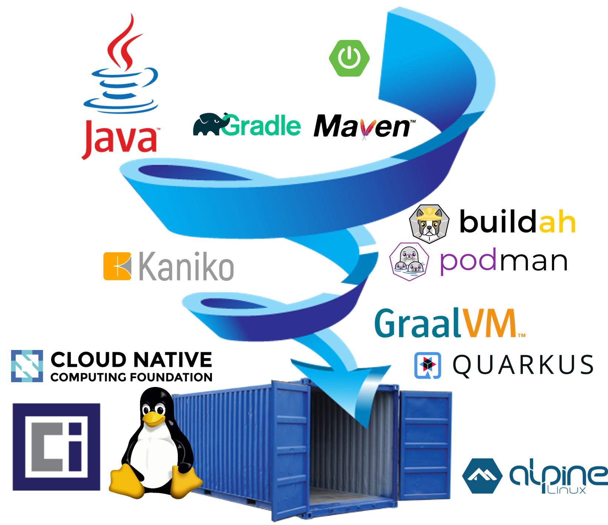

# Distilled JRE Apps in Containers #

The scenario walks through a series of steps for distilling a container to its minimum to support your Java application.

For years one of Java's strengths was _write once, run anywhere_ [(WORA)](https://en.wikipedia.org/wiki/Write_once,_run_anywhere). With containers it's now polyglot and _package once, run anywhere_ [(PORA)](https://www.theserverside.com/feature/How-the-Docker-Engine-simplifies-DevOps-from-staging-to-deployment). All this is about writing our code to be agnostic from the target.

Java remains relevant for containers. However, it would appear between WORA and PORA there is some redundancy. If your application is running in a container and you know exactly what is in the container, why would you need a Java Runtime engine that can run anywhere? Thanks to containers they can run anywhere. What we put _inside_ our containers should be statically defined and linked as natively as possible, at build time.

What if we could avoid putting a whole JRE in a container yet still deliver a working Java app? Blasphemy.

## Distillation Pattern ##

The distillation pattern is about applying best practices to make your containers small, simple, secure, and fast. These ideas all contribute to container distillation:

| Concept                | Summary                                                      |
|------------------------|--------------------------------------------------------------|
| High cohesion          | All things in the container are used and purposeful          |
| Low coupling           | All public access is used and purposeful                     |
| Idempotent             | Well tested and known versioned dependencies                 |
| Immutable              | Simplicity increases when things do not change at runtime    |
| Small attack surface   | Remove access points like ports and file mounts              |
| Small container images | Remove all thing not used, reduce storage and transmit costs |
| Fast startup time      | Expect ephemeral containers to fail, restart and scale       |
| Fast execution time    | Performance pays, CPUs and memory are limited resources      |

You will learn how to:

- install a container registry onto Kubernetes
- build and run a simple Java application
- build and run the same application with a container
- use multi-stage technique for building containers
- leverage Java 9+ modularity with JLink
- compile Java to a native binary and run it from a container
- start using GraalVM
