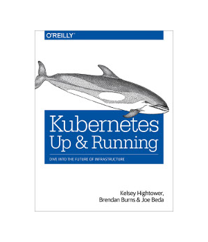

# Jobs #

This scenario takes you through the basics of [Job resources](https://kubernetes.io/docs/concepts/workloads/controllers/jobs-run-to-completion/) on Kubernetes. Chapter 10 of the 2017 [O'Reilly Kubernetes Up & Running](http://shop.oreilly.com/product/0636920043874.do[]) book from [Kelsey Hightower](https://twitter.com/kelseyhightower), [Brendan Burns](https://twitter.com/BrendanBurns), and [Joe Beda](https://blog.heptio.com/@jbeda) has a very nice explanation of Jobs. Therefore, this scenario is simply a manifestation of their explanation in Katacoda form.

> [From the Safari online promotion for the book:](https://www.oreilly.com/library/view/kubernetes-up-and/9781491935668/ch10.html)
>> A Job creates Pods that run until successful termination (i.e., exit with 0). In contrast, a regular Pod will continually restart regardless of its exit code. Jobs are useful for things you only want to do once, such as database migrations or batch jobs. If run as a regular Pod, your database migration task would run in a loop, continually repopulating the database after every exit.

>> The Job object is responsible for creating and managing pods defined in a template in the Job specification. These pods generally run until successful completion. The Job object coordinates running a number of pods in parallel.

As a prerequisite, we assume you have an introductory working knowledge of Kubernetes covered in the _First App_ scenario of this course.

In the following steps you will learn:

- how Jobs are defined and work in Kubernetes,
- how Kubernetes resilience recovers failed jobs,
- how Job can serially or in parallel,
- why it's more efficient to run Jobs in parallel,
- how Jobs can process a work queue.

The Jobs feature is described in the [Kubernetes documentation](https://kubernetes.io/docs/concepts/workloads/controllers/jobs-run-to-completion/). More references to documentation is listed at the end of this scenario.
