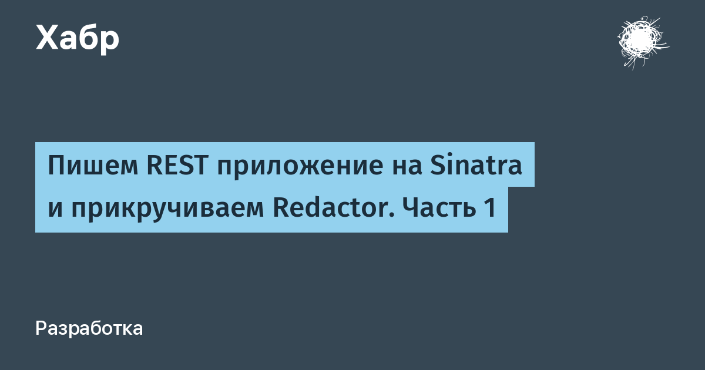

# Mutating admissions controller

Предыдущие два упражнения продемонстрировали возможности валидации контроллеров доступа **validating admissions controllers,** которые будут отклонять ресурсы, которые не соответствуют политике, указанной в **Gatekeeper ConstraintTemplate**. **OPA Gatekeeper** в настоящее время не поддерживает генерацию **Mutating admissions controllers** на основе **ConstraintTemplates**, но для демонстрации рабочего примера мы будем использовать простое приложение **REST API (Ruby Sinatra app))**, работающий в кластере **Kubernetes**.

Аналогично проверке контроллеров доступа  **Validating admissions controllers,** контроллеры **Mutating Admissions** могут быть настроены на уведомление о том, что в кластере происходят определенные события, такие как **CREATE** или **UPDATE**. Вместо возврата ответа да или нет на **Kubernetes API** контроллер **Mutating admissions** возвращает объект [JSON patch](http://jsonpatch.com/), который сообщит Kubernetes, как изменить входящий ресурс.

This example will show how we can modify a submitted pod to add a label after it has been submitted to the cluster. This pattern can be extended to a number of other applications like injecting environment variables, adding side car containers, generating/injecting TLS certificates automatically, and so on. This is a powerful pattern for providing sane defaults to cluster consumers without placing the burden on those users to know how or what to implement for this type of information.

Этот пример покажет, как мы можем изменить **submitted pod**, чтобы добавить **label** после его отправки - **submitted** в кластер. Этот **pattern** может быть расширен **extended** на ряд других приложений, таких как внедрение переменных среды **injecting environment variables**, **adding side car containers**, автоматическая генерация/иньекция сертификатов **generating/injecting TLS certificates automatically** и т. д. Это мощный **pattern** для предоставления разумных значений по умолчанию потребителям кластера, не накладывая на этих пользователей бремя, чтобы знать, как или что реализовать для этого типа информации.

Для начала нам нужно создать пространство имен для нашего **mutating webhook**: `kubectl create ns sinatra-mutating-webhook`{{execute}}

**Kubernetes** требует, чтобы все контроллеры доступа общались по **TLS**, поэтому нам нужно сгенерировать запрос на подпись сертификата, который будет подписан центром сертификации кластера **Kubernetes**, который затем будет использоваться нашим **REST API**.

Чтобы упростить это, выполните следующие действия, чтобы сгенерировать, подписать **sign** и загрузить используемый сертификат **certificate**: `title="sinatra-mutating-webhook" ./gen-cert.sh`{{execute}}

Прежде чем загружать наш **Mutating Webhook**, нам нужно включить в нашу конфигурацию кластерный **CA bundle** кластера **Kubernetes**:

```
ca_bundle=$(kubectl get configmap -n kube-system extension-apiserver-authentication -o=jsonpath='{.data.client-ca-file}' | base64 | tr -d '\n')
sed -i -e "s/CA_BUNDLE_HERE/$ca_bundle/g" mutating-webhook.yaml
```{{execute}}

Теперь мы можем загрузить наш **Mutating Webhook**, чтобы начать получать обновления от **Kubernetes API**: 

`kubectl apply -f mutating-webhook.yaml`{{execute}}
 
Подождите, пока наш **mutating webhook** станет готовым: 

`kubectl wait -n sinatra-mutating-webhook pod --all --for=condition=Ready --timeout=45s`{{execute}}

Наконец, чтобы увидеть, как это работает в действии, мы можем загрузить несколько **pods**, чтобы увидеть, как они добавляют **label** к каждому **pod** _unless_  они указывают специальную аннотацию **specific annotation**, чтобы пропустить прикрепление метки **skip attaching a label**: 

`kubectl apply -f mutating-webhook-pod-test.yaml`{{execute}}

Запустите следующее, чтобы увидеть, какие **pods** были видоизменены **mutated**  с помощью прикрепленной метки `fun` label. 
Notice: Обратите внимание, что **excluded pod**  был пропущен, так как на нем была аннотация `mutating-webhook.example.com / exclude`:

`kubectl get po -n sinatra-mutating-webhook-test --show-labels`{{execute}}

Вы также можете просмотреть логи нашего **Mutating Webhook** для просмотра **response object**, возвращенного в **Kubernetes API**:

 `kubectl logs -n sinatra-mutating-webhook deploy/sinatra-mutating-webhook | grep -v 'GET /health'`{{execute}}

Наконец, не стесняйтесь просматривать пример кода **REST api**, проверив **mutating_webhook.rb**, чтобы увидеть логику этого примера или расширить ее, если вы знакомы с **Ruby/Sinatra**:

- `MUTATING_WEBHOOK_POD=$(kubectl get pod -n sinatra-mutating-webhook -l run=sinatra-mutating-webhook -o jsonpath='{.items[0].metadata.name}')`{{execute}}
- `kubectl exec -n sinatra-mutating-webhook $MUTATING_WEBHOOK_POD -- cat /app/mutating_webhook.rb`{{execute}}

 
Не стесняйтесь просматривать пример кода **REST api**, проверив **mutating_webhook.rb**, чтобы увидеть логику этого примера или расширить ее, если вы знакомы с **Ruby/Sinatra**:

В качестве идей по использованию **Sinatra REST API & Kubernetes API**
[Пишем REST приложение на Sinatra и прикручиваем Redactor. Часть 1](https://habr.com/ru/post/144277/)
[Пишем REST приложение на Sinatra и прикручиваем Redactor. Часть 2] https://habr.com/ru/post/144488/

Credit for this mutating webhook goes to Austin Heiman with the code located [here](https://github.com/atheiman/kubernetes/tree/master/sinatra-mutating-webhook).