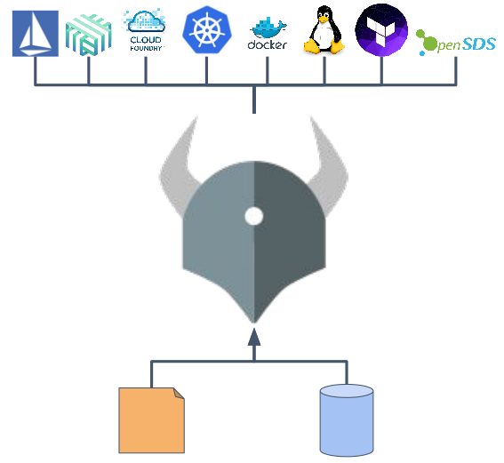
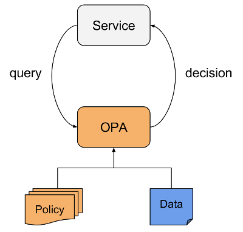

## Open policy agent and admissions controllers

В конце марта (March 29, 2018) у фонда **CNCF**, помогающего развивать Open Source-проекты для облачных **(cloud native)** приложений, случилось двойное пополнение: в «песочницу» были добавлены **OPA (Open Policy Agent)** и **SPIFFE (Secure Production Identity Framework For Everyone)**, которых роднит тема безопасности. 

## Open Policy Agent

**Open Policy Agent (GitHub)** — написанный на языке **Go** движок, предлагающий унифицированный способ использования политик, которые учитывают контекст и работают по всему стеку инфраструктуры, применяемой для облачных приложений.

 

Инициатива по созданию **Open Policy Agent** исходит от компании **Netflix**. Как рассказывали её представители на **CloudNativeCon US 2017**, этот проект позволил решить проблему авторизации в масштабах крупного облачного окружения. Если вкратце, то инженеры компании хотели обеспечить стандартизированную (и простую) возможность определять и принудительно исполнять правила следующего вида: Субъект **(identity, I)** может/не может выполнять Операцию **(operation, O)** на Ресурсе **(resource, R)** — во всех возможных комбинациях во всей имеющейся экосистеме.

При этом, как легко догадаться, экосистема **Netflix** весьма разнообразна: в ней не один тип ресурсов (**REST**-интерфейсы, **gRPC**-методы, **SSH**, **Kafka topics** и т.п.), не один тип субъектов, а также множество используемых протоколов (**HTTP/HTTPS, gRPC**, свои бинарные), языков программирования (**Java, Node.js, Python, Ruby**)… Наконец, критичное требование ко всей этой системе — минимальная задержка: например, один узел кластера Kafka обрабатывает тысячи запросов в секунду, поэтому о прослойке, требующей для авторизации более 1 миллисекунды, и речи быть не могло.

Общая схема решения, к которому пришли в **Netflix**, получилась следующей:

 

А в более подробном представлении архитектура системы, использующей OPA, выглядит так (слайды взяты из этой презентации):

Этот курс научит вас, как использовать  [Open Policy Agent](https://www.openpolicyagent.org/) и [Gatekeeper](https://github.com/open-policy-agent/gatekeeper) для создания Kubernetes [validating admissions controllers](https://kubernetes.io/docs/reference/access-authn-authz/extensible-admission-controllers/). Этот курс также покажет случай простого мутирующего контроллера доступа **mutating admissions controller**.
