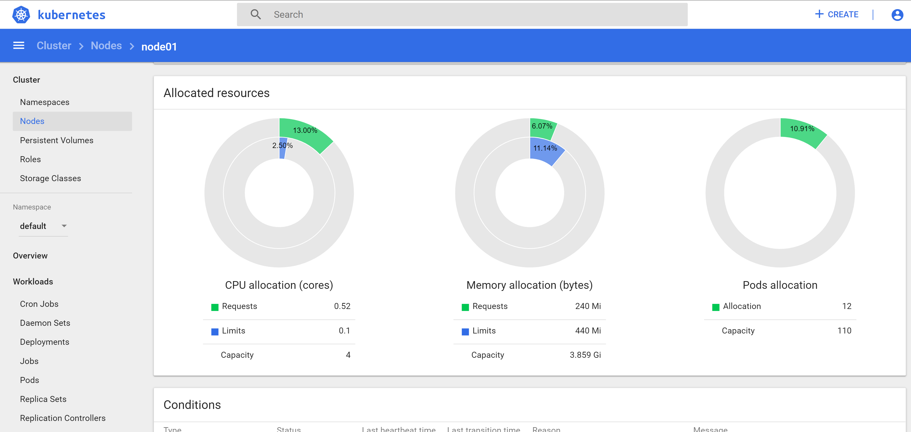

# Basic Kubernetes Observability #

This scenario explores the basic techniques for observing the state of Kubernetes using metrics.

In the following steps you will learn how to:

- access metrics information produced by each cAdvisor in each Kubelet,
- inspect resources using the _Resource Metrics API_,
- viewing metrics reported by Metrics Server.
