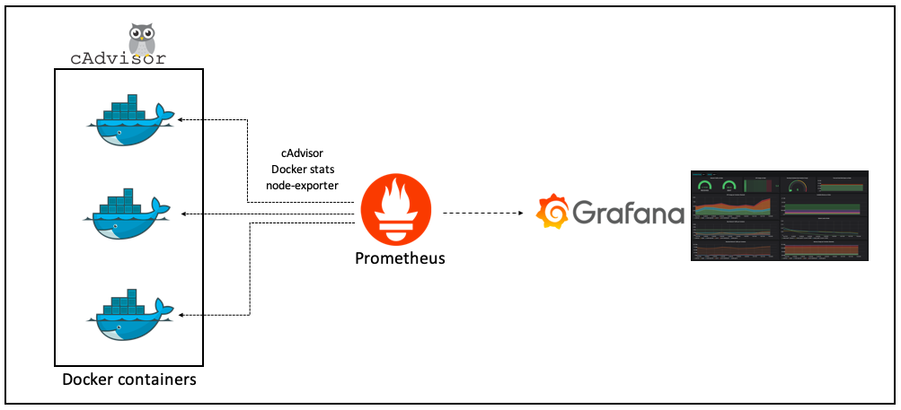

# Основы Kubernetes Observability #

Этот сценарий исследует основные методы для наблюдения за состоянием Kubernetes с помощью метрик.

В следующих шагах вы узнаете, как:

- получить доступ к информации о показателях, созданной каждым **cAdvisor** в каждом **Kubelet**,
- проверять ресурсы, используя **Resource Metrics API**,
- просмотр метрик, сообщаемых **Metrics Server**.

**Monitoring Docker containers using cAdvisor and Prometheus**

https://medium.com/@bhargavshah2011/monitoring-docker-containers-using-cadvisor-and-prometheus-5350ae038f45

**Анонс веб-интерфейса Kubernetes Web View (и краткий обзор других web UI для Kubernetes)** 

https://habr.com/ru/company/flant/blog/468041/

