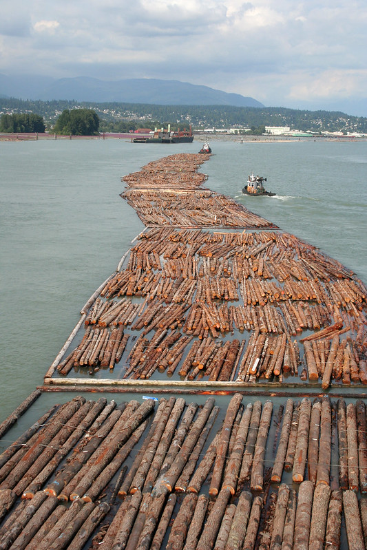

# Kubernetes Logging #

Traditionally, applications on servers generate logs that are often routed to `/var/log`. Container runtime engines and Kubernetes also produce logs in the same location, but there are considerations when applications are scaled and replicated across many nodes in your cluster. The Kubernetes API has techniques to obtain these logs. These are solid techniques for debugging and spot checking. Production level observability includes patterns that use DaemonSets and Sidecars to collect and stream these logs to other data stores optimized for persistence and queries.

This scenario explores the basic techniques for inspecting the logs generated by Kubernetes and containers distributed across your cluster.

In the following steps you will learn how to:

- ensure your application generates logs to streams,
- inspect Kubernetes cluster events,
- inspect container logs across multiple Pods,
- use some convenient command-line tools to view log aggregations.
