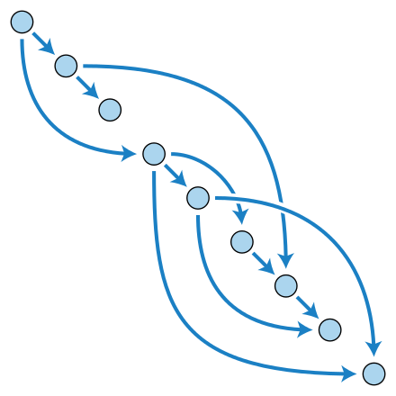

Pipelines are entities that group a series of Tasks that accomplish a specific build or delivery goal. Pipelines can be triggered by an event or invoked from a PipelineRun entity. Tasks can be simply sequentially ordered or organized into a [Directed Acyclic Graph (DAG)](https://en.wikipedia.org/wiki/Directed_acyclic_graph).

For our pipeline, we have defined the two sequential tasks to build and deploy the application.

`cat pipeline/pipeline.yaml`{{execute}}

Apply this Pipeline declaration.

`kubectl apply -f pipeline/pipeline.yaml`{{execute}}

Verify the Pipeline has been declared.

`tkn pipelines list`{{execute}}

The pipeline is defined but it's not running, yet.
