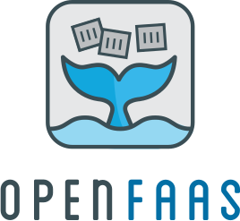

# OpenFaaS on Kubernetes #

[OpenFaaS](https://www.openfaas.com/) is a framework for building serverless functions with Docker and Kubernetes which has first class support for metrics. Any process can be packaged as a function enabling you to consume a range of web events without repetitive boiler-plate coding.

## Key Features ##

- Ease of use through UI portal and one-click install
- Write functions in any language for Linux or Windows and package in Docker/OCI image format
- Portable - runs on existing hardware or public/private cloud
- Kubernetes and Docker Swarm native
- CLI available with YAML format for templating and defining functions
- Scales as demand increases

You will learn how:

- to install OpenFaaS on Kubernetes
- to interact with OpenFaaS from the command-line and its portal
- functions are deployed and removed
- functions are named, exposed, and invoked
- functions are listed, inspected and monitored
- functions automatically scale up and down based on load

The OpenFaaS architecture is described in the [OpenFaaS documentation](https://docs.openfaas.com/). More references to documentation and examples listed at the end of this scenario.
