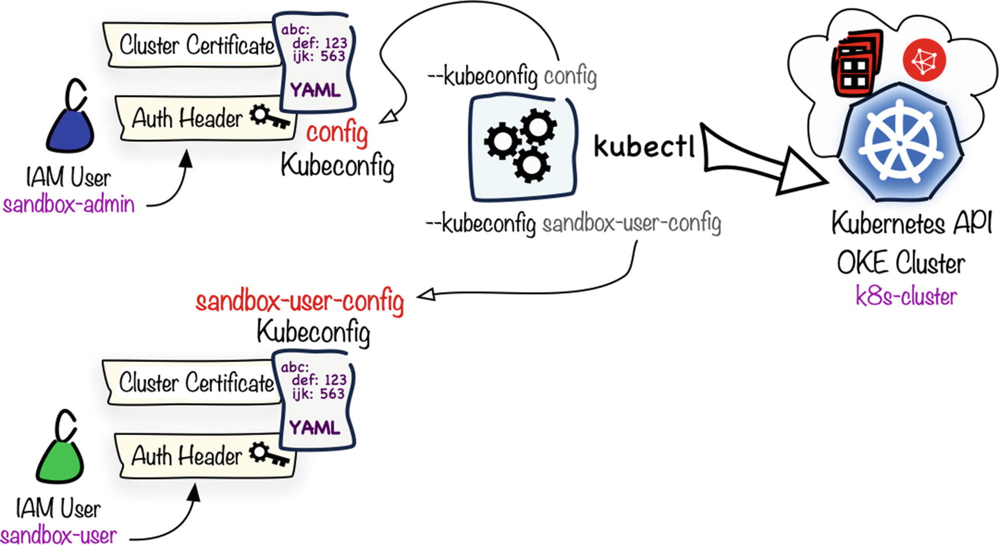

При первой установке **Kubernetes** вам понадобится файл **kubeconfig** для доступа к кластеру. Этот файл указывает, как подключиться к серверу **API** и какие учетные данные **credential** использовать при аутентификации.

Обычно он хранится в **~/.kube/config**, но также может быть определен как аргумент командной строки или переменная окружения **KUBECONFIG**.

Давайте посмотрим наш файл **kubeconfig**:

`cat ~/.kube/config`{{execute}}

## Структура Kubeconfig

### `clusters`

Этот секция определяет кластер **Kubernetes**. Указывает **URL**-адрес для доступа к серверу **API** и сертификат **SSL** для валидации.

> Часто в конфигурации **YAML Kubernetes** вы найдете значения в кодировке **Base64**. Это позволяет произвольным данным быть представленными в виде простого текста.

### `users`

В этих секции определяются учетные данные **credentials** для аутентификации, используемые с кластером.

В **kubeconfig** демонстрационной среды мы выполняем аутентификацию с использованием **SSL certificate**. Другие методы аутентификации, в зависимости от кластера, включают в себя:

- Tokens
- OAuth (позволяет аутентификацию c помощью Active Directory, GitHub, Google, etc.)

### `contexts`

**Contexts section** объединяет определения кластеров **clusters definition** и определения пользователей **user definitions**.

Инструмент командной строки **kubectl** работает с этими объектами контекстов **contexts objects.**

> У нас есть только один пользователь, кластер и **context**, определенные в файле **kubeconfig**. Можно определить несколько из каждого в данном файле **kubeconfig**.
