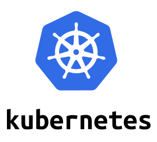

For this scenario, Katacoda has just started a fresh Kubernetes cluster for you. Verify it's ready for your use.

`kubectl version --short && \
kubectl get componentstatus && \
kubectl get nodes && \
kubectl cluster-info`{{execute}}

The [Helm](https://helm.sh/) package manager used for installing applications on Kubernetes is also available.

`helm version --short`{{execute}}

## Kubernetes Dashboard ##

You can administer your cluster with the `kubectl` CLI tool or use the visual Kubernetes Dashboard. Use this script to access the protected Dashboard.

`token.sh`{{execute}}
