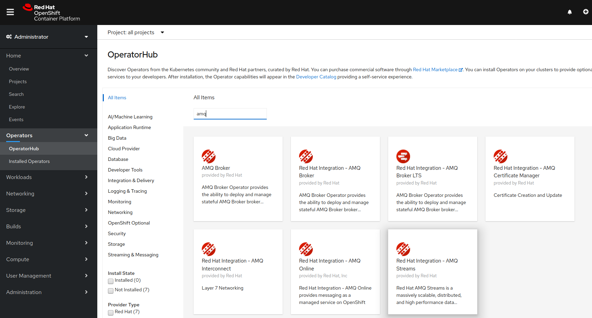
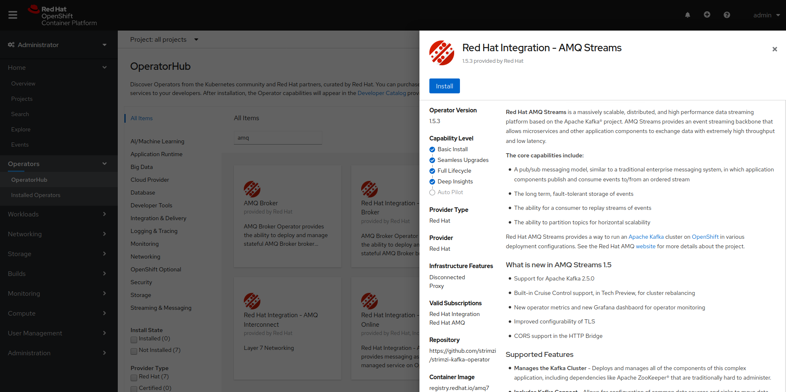
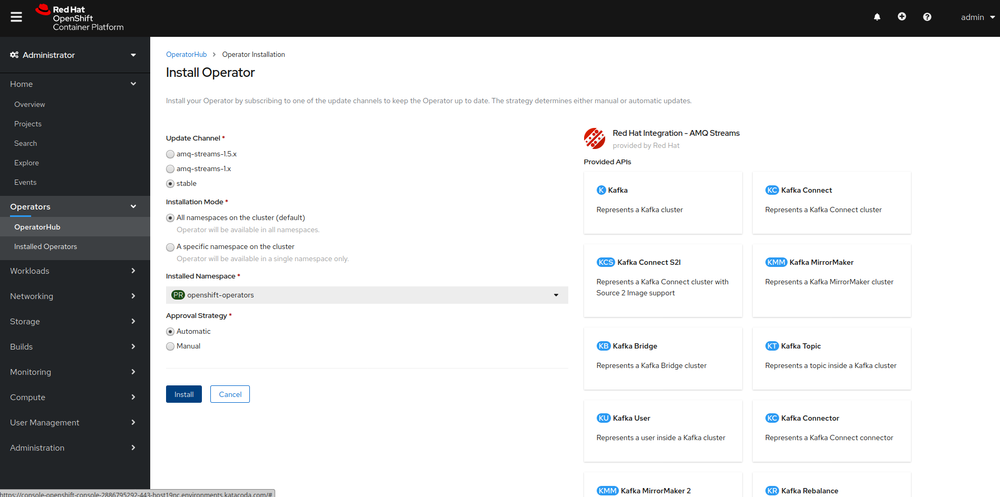
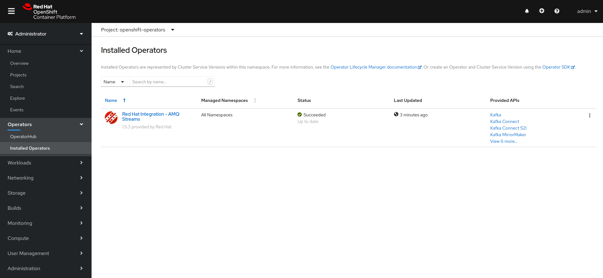

Чтобы запустить **AMQ Streams** & **Jaeger**, вам понадобится доступ к среде **OpenShift 4.5**. Давайте установим основы.

## Вход в кластер через панель управления Dashboard

Кликните [Console](https://console-openshift-console-[[HOST_SUBDOMAIN]]-443-[[KATACODA_HOST]].environments.katacoda.com) tab чтобы открыть панель управления dashboard.

Затем вы сможете войти в систему с правами администратора с помощью:

* **Username:** ``admin``{{copy}}
* **Password:** ``admin``{{copy}}

## Вход в кластер через CLI

Перед созданием любых приложений залогинтесь в системе как **admin**. Это потребуется, если вы хотите войти в веб-консоль и
используй это.

Чтобы залогинется в кластер OpenShift из **_Terminal_** выполните:

``oc login -u admin -p admin``{{execute}}

Это позволит вам войти в систему, используя учетные данные **credentials**:

* **Username:** ``admin``
* **Password:** ``admin``

Используйте те же учетные данные **credentials** для входа в веб-консоль.

## Создание проекта

Начнем с создания нового проекта для этой демонстрации:

``oc new-project amq-streams``{{execute}}

После настройки проекта давайте установим оператор **AMQ** в проекте **amq-streams** и оператор **Jaeger** для трейсинга за всеми пространствами имен кластера:

Далее установим оператор **Jaeger** для трейсинга: