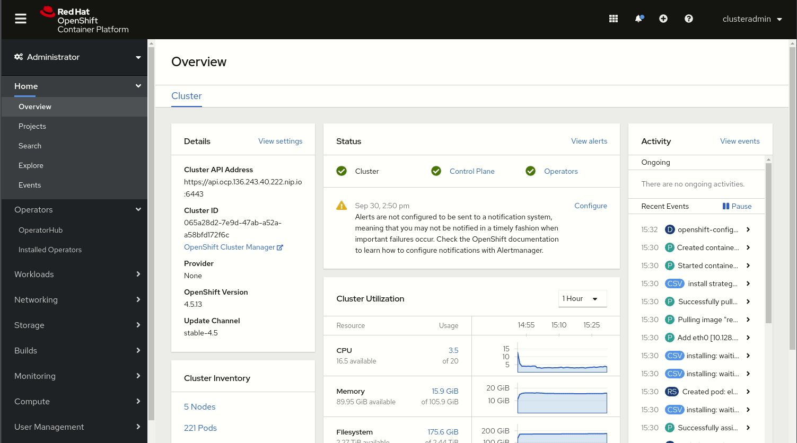

Давайте установим оператор **Jaeger** для трейсинга:




Теперь, когда у нас установлены операторы **operators**, мы можем приступить к созданию некоторых **custom resources**, которые будут развертывать нашу среду. Во-первых, давайте создадим два наших кластера, где **europe-cluster** является исходным кластером, а **us-cluster** - целевым **target one**. Каждый из кластеров будет использовать **OCS RBD** для сохранения записанных данных.

```
$ oc create -f - <<EOF
apiVersion: kafka.strimzi.io/v1beta1
kind: Kafka
metadata:
  name: europe-cluster
spec:
  kafka:
    version: 2.4.0
    replicas: 3
    listeners:
      plain: {}
      tls: {}
    config:
      offsets.topic.replication.factor: 3
      transaction.state.log.replication.factor: 3
      transaction.state.log.min.isr: 2
      log.message.format.version: "2.4"
    storage:
      type: persistent-claim
      size: 20Gi
      deleteClaim: true
  zookeeper:
    replicas: 3
    storage:
      type: persistent-claim
      size: 10Gi
      deleteClaim: true
  entityOperator:
    topicOperator: {}
    userOperator: {}
---
apiVersion: kafka.strimzi.io/v1beta1
kind: Kafka
metadata:
  name: us-cluster
spec:
  kafka:
    version: 2.4.0
    replicas: 3
    listeners:
      plain: {}
      tls: {}
    config:
      offsets.topic.replication.factor: 3
      transaction.state.log.replication.factor: 3
      transaction.state.log.min.isr: 2
      log.message.format.version: "2.4"
    storage:
      type: persistent-claim
      size: 20Gi
      deleteClaim: true
  zookeeper:
    replicas: 3
    storage:
      type: persistent-claim
      size: 10Gi
      deleteClaim: true
  entityOperator:
    topicOperator: {}
    userOperator: {}
EOF
```

Теперь давайте проверим, что наши кластеры действительно были созданы и что они заявили о желаемом хранилище **storage** из нашего **OCS cluster**:

``oc get pods``{{execute}}


``oc get pvc``{{execute}}

Теперь, когда у нас есть два наших кластера, давайте создадим тему для исходного кластера, которая будет реплицирована в будущем:

```
$ oc create -f - <<EOF
apiVersion: kafka.strimzi.io/v1beta1
kind: KafkaTopic
metadata:
  name: my-topic
  labels:
    strimzi.io/cluster: europe-cluster
spec:
  partitions: 12
  replicas: 3
  config:
    retention.ms: 7200000
    segment.bytes: 1073741824
EOF
```

В этом разделе есть метка **strimzi.io/cluster** , указывающая на исходный кластер. Теперь проверим, действительно ли **topic** создан:

``oc get kt``{{execute}}

В этом **topic**, **12 partitions** с коэффициентом репликации 3, что означает, что каждый узел **Kafka** будет основным из **4 partitions** и второстепенным из **8 other partitions**.

```
$ oc create -f - <<EOF 
apiVersion: kafka.strimzi.io/v1beta1
kind: KafkaUser
metadata:
  name: my-us-user
  labels:
    strimzi.io/cluster: us-cluster
spec:
  authentication:
    type: tls
  authorization:
    type: simple
    acls:
      - resource:
          type: topic
          name: my-topic
          patternType: literal
        operation: Read
        host: "*"
      - resource:
          type: topic
          name: my-topic
          patternType: literal
        operation: Describe
        host: "*"
      - resource:
          type: group
          name: my-group
          patternType: literal
        operation: Read
        host: "*"
      - resource:
          type: topic
          name: my-topic
          patternType: literal
        operation: Write
        host: "*"
      - resource:
          type: topic
          name: my-topic
          patternType: literal
        operation: Create
        host: "*"
      - resource:
          type: topic
          name: my-topic
          patternType: literal
        operation: Describe
        host: "*"
---
apiVersion: kafka.strimzi.io/v1beta1
kind: KafkaUser
metadata:
  name: my-europe-user
  labels:
    strimzi.io/cluster: europe-cluster
spec:
  authentication:
    type: tls
  authorization:
    type: simple
    acls:
      - resource:
          type: topic
          name: my-topic
          patternType: literal
        operation: Read
        host: "*"
      - resource:
          type: topic
          name: my-topic
          patternType: literal
        operation: Describe
        host: "*"
      - resource:
          type: group
          name: my-group
          patternType: literal
        operation: Read
        host: "*"
      - resource:
          type: topic
          name: my-topic
          patternType: literal
        operation: Write
        host: "*"
      - resource:
          type: topic
          name: my-topic
          patternType: literal
        operation: Create
        host: "*"
      - resource:
          type: topic
          name: my-topic
          patternType: literal
        operation: Describe
        host: "*"
EOF
```

Теперь давайте проверим, что наши пользователи созданы с помощью настраиваемого ресурса **KafkaUser custom resource**:
 
``oc get ku``{{execute}}


Hit ctrl+c on the terminal window. This will also terminate the execution of the integration.
