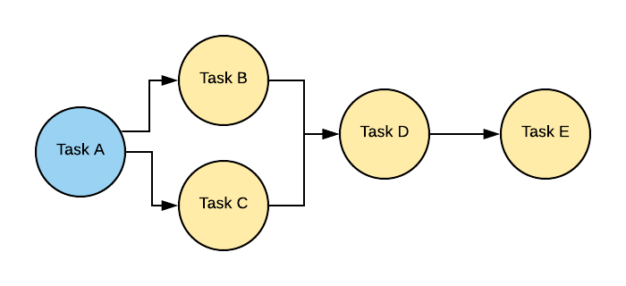

# Airflow Cluster on Kubernetes #

**Apache Airflow** — это **workflow** менеджер, для разработки, планирования и мониторинга batch-процессов.. **Airflow** был разработан в **2014** году в компании **Airbnb**, автор **Maxime Beauchemin**. Позже инструмент был передан под опеку в организацию **Apache**, а в январе **2019** получил статус **Top-Level** проекта. 

<iframe style="width: 700px;height: 400px;" src="https://www.youtube-nocookie.com/embed/Fvu2oFyFCT0" frameborder="0" allow="accelerometer; autoplay; encrypted-media; gyroscope; picture-in-picture" allowfullscreen></iframe>

**Maxime Beauchemin - Advanced Data Engineering Patterns with Apache Airflow**

<iframe style="width: 700px;height: 400px;" src="https://www.youtube-nocookie.com/embed/VrsVbuo4ENE" frameborder="0" allow="accelerometer; autoplay; encrypted-media; gyroscope; picture-in-picture" allowfullscreen></iframe>

**Airflow on Kubernetes: Dynamic Workflows Simplified - Daniel Imberman, Bloomberg & Barni Seetharaman**

Основные сущности рабочего процесса на **Apache Airflow**:

- Направленные ациклические графы (DAG)
- Планировщик (Scheduler)
- Операторы (Operators)
- Задачи (Tasks)

## Существует несколько сценариев использования связки A**irflow** и **Kubernetes**:

- запуск самого **Airflow** в **Kubernetes** кластере
- использование **Airflow** для запуска задач **(jobs)** в **Kubernetes** кластере
- оба предыдущих варианта одновременно

Рассмотрим эти сценарии по порядку. **Airflow** состоит из отдельных компонентов, основные из которых планировщик **(scheduler)**, вебсервер **(webserver)** и воркеры **(workers)**. В зависимости от конкретного случая, требованиям к отказоустойчивости и количества одновременно выполняющихся задач, эти компоненты можно запускать по отдельности или все вместе.

## **DAG (Directed Acyclic Graph)**

**DAG** — это ориентированный ациклический граф, т.е. граф у которого отсутствуют циклы, но могут быть параллельные пути, выходящие из одного и того же узла. Простыми словами **DAG** это сущность, объединяющая ваши задачи в единый data pipeline (или цепочку задач), где явно видны зависимости между узлами.

На картинке можно видеть классический **DAG**, где **Task E** является конечным в цепочке и зависит от всех задача слева от него.

## Operator

Оператор это звено в цепочке задач. Используя оператор разработчик описывает какую задачу необходимо выполнить. В **Airflow** есть ряд готовых операторов, например:

- **PythonOperator** — оператор для исполнения python кода
- **BashOperator** — оператор для запуска bash скриптов/команд
- **PostgresOperator** — оператор для вызова SQL запросов в PostgreSQL БД
- **RedshiftToS3Transfer** — оператор для запуска UNLOAD команды из Redshift в S3
- **EmailOperator** — оператор для отправки электронных писем

**BashOperator** — оператор для запуска bash скриптов/команд  
https://airflow.apache.org/docs/stable/howto/operator/bash.html

# **Kubernetes Operator**

**KubernetesPodOperator** позволяет создавать **pods** в **Kubernetes**. Работает с любым типом **executor**.

Описание **KubernetesPodOperator**  можно найти в документации **Apache Airflow**.  
https://airflow.apache.org/docs/stable/kubernetes.html

**DAG** является объединяющей сущностью для набора операторов, т.е. если вернуться к картинке выше, то **Task A**, **Task B** и т.д. это отдельные операторы.

Важно! Операторы не могут принимать возвращаемые значения от выполнения предыдущих операторов в цепочке (как, например, цепочка из вызовов функций), т.к. могут исполняться в разном адресном пространстве и даже на разных физических машинах.

## Sensor 

Сенсор это разновидность Operator, его удобно использовать при реализации событийно ориентированных пайплайнов. Из стандартного набора есть, например:

- **PythonSensor** — ждём, когда функция вернёт True
- **S3Sensor** — проверяет наличие объекта по ключу в S3-бакете
- **RedisPubSubSensor** — проверяет наличие сообщения в pub-sub очереди
- **RedisKeySensor** — проверяет существует ли переданный ключ в Redis хранилище

Это лишь малая часть доступных для использования сенсоров. Чтобы создать свой сенсор, достаточно унаследоваться от **BaseSensorOperator** и переопределить метод **poke**.

## Hook

Хуки это внешние интерфейсы для работы с различными сервисами: базы данных, внешние **API** ресурсы, распределенные хранилища типа **S3, redis, memcached** и т.д. Хуки являются строительными блоками операторов и берут на себя всю логику по взаимодействию с хранилищем конфигов и доступов (о нём ниже). 

## **Airflow Executors**
Хочу немножко отвлечься от запуска **Airflow** и рассказать про очень важную концепцию — **Executors**. Как понятно из названия, **Executors** отвечают за исполнение задач. В **Airflow** есть несколько видов исполнителей:

- **SequentialExecutor**
- **LocalExecutor**
- **CeleryExecutor**
- **DaskExecutor**
- **KubernetesExecutor**

В боевой среде чаще всего встречается **CeleryExecutor**, который, как можно догадаться, использует **Celery**.

## **SequentialExecutor**
Этот исполнитель установлен в качестве значения по умолчанию в **airflow.cfg** у параметра **executor** и представляет из себя простой вид воркера, который не умеет запускать параллельные задачи. Как можно догадаться, в конкретный момент времени выполняться может только одна единственная задача. Этот вид исполнителя используют в ознакомительных целях, для продуктивной среды он категорически не подходит.

## **LocalExecutor**
Этот вид исполнителя даёт максимальные ощущения продуктивной среды в тестовом окружении (или окружении разработки). Он умеет выполнять задачи параллельно (например, исполнять несколько DAGов одновременно) путём порождения дочерних процессов, но всё же не совсем предназначен для продакшена ввиду ряда проблем:

Ограничение при масштабировании (возможно эта проблема не будет актуальна для вас), исполнитель этого типа ограничен ресурсами машины на котором он запущен
Отсутствие отказоустойчивости. Если машина с этим типом воркера падает, то задачи перестают исполнять до момента её возвращения в строй.
При небольшом количестве задач всё же можно использовать **LocalExecutor**, т.к. это проще, быстрее и не требует настройки дополнительных сервисов.

## **CeleryExecutor**
Наиболее популярный вид исполнения задач. Под капотом использует всю магию таск-менеджера **Celery**, а соответственно тянет за собой все зависимости этого инструмента. Чтобы использовать **CeleryExecutor** необходимо дополнительно настроить брокер сообщений. Чаще всего используют либо **Redis** либо **RabbitMQ**. Преимущества этого вида в том, что его легко масштабировать — поднял новую машину с воркером, и он готов выполнять требуемую работу, а также в отказоустойчивости. В случае падения одного из воркеров его работа будет передана любому из живых.

## **DaskExecutor**
Очень похож на **CeleryExecutor**, но только вместо **Celery** использует инструмент** Dask**, в частности **dask-distributed**.

## **KubernetesExecutor**
Относительно новый вид исполнения задач на кластере **Kubernetes**. Задачи исполняются как новые **pod** инстансы.
