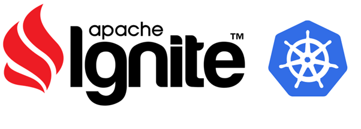

# Apache Ignite (In-Memory Cluster) on Kubernetes #

  

  

**Apache Ignite** - это распределенная база данных с открытым исходным кодом (без непрерывного обновления), платформа для кэширования и обработки, предназначенная для хранения и вычисления больших объемов данных в кластере узлов.

База данных **Apache Ignite** использует **RAM** в качестве уровня хранения и обработки по умолчанию, таким образом, принадлежа к классу вычислительных платформ в памяти.  

База данных **Apache Ignite** использует **ОЗУ** в качестве уровня хранения и обработки по умолчанию, поэтому он относится к классу вычислительных платформ в памяти. Уровень диска является необязательным, но после его включения будет храниться полный набор данных, тогда как уровень памяти будет кэшировать полный или частичный набор данных в зависимости от его емкости.

Независимо от используемого **API** данные в **Ignite** хранятся в виде пар ключ-значение. Компонент базы данных масштабируется горизонтально, распределяя пары ключ-значение по всему кластеру таким образом, что каждому узлу принадлежит часть общего набора данных. Данные автоматически перебалансируются всякий раз, когда узел добавляется или удаляется из кластера.

В дополнение к распределенной основе **Apache Ignite** поддерживает множество **API**, включая **API-интерфейсы** с ключевыми значениями, совместимые с **JCache**, **ANSI-99 SQL** с объединениями, транзакции **ACID**, а также вычисления **MapReduce**. 

<iframe style="width: 700px;height: 400px;" src="https://www.youtube-nocookie.com/embed/MZzkkIHGMtI" frameborder="0" allow="accelerometer; autoplay; encrypted-media; gyroscope; picture-in-picture" allowfullscreen></iframe>

**Best Practices for a Microservices Architecture on Apache Ignite**

<iframe style="width: 700px;height: 400px;" src="https://www.youtube-nocookie.com/embed/5OZmqO5D-7o" frameborder="0" allow="accelerometer; autoplay; encrypted-media; gyroscope; picture-in-picture" allowfullscreen></iframe>

**Fast Data with Apache Ignite and Apache Spark - Christos Erotocritou**

<iframe style="width: 700px;height: 400px;" src="https://www.youtube-nocookie.com/embed/YEjZKt_HQik" frameborder="0" allow="accelerometer; autoplay; encrypted-media; gyroscope; picture-in-picture" allowfullscreen></iframe>

**Deploying Apache Ignite and GridGain – Top 7 FAQs**
