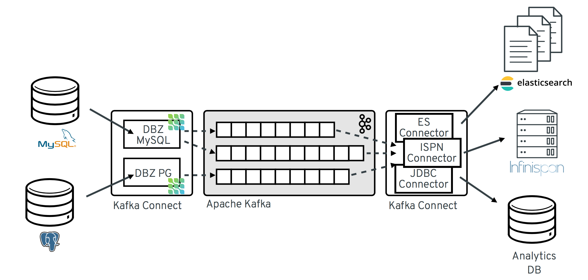
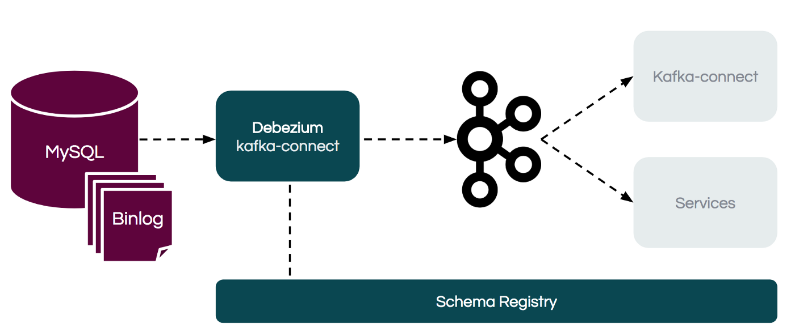
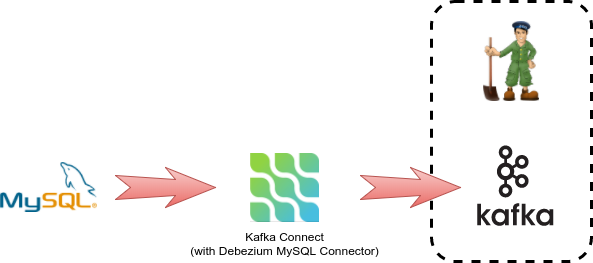

## Что вы изучите ##

[Архитектура Debezium, Kafka Connect, Apache Kafka](https://docs.google.com/document/d/1vQdTzz1tehapECtJQ3PPxVzfsoNhNRwzYgGU2hFtmwA/edit)  
https://docs.google.com/document/d/1vQdTzz1tehapECtJQ3PPxVzfsoNhNRwzYgGU2hFtmwA/  

  
  
Простая архитектура стека **Change data capture (CDC)** с разъемом **MySQL debezium**  

В этом сценарии вы изучите больше о [Debezium](http://debezium.io/), проекте, который обеспечивает сбор данных об изменениях для любой из поддерживаемых баз данных.
* MySQL
* PostgreSQL
* MongoDB
* Microsoft SQL Server
* Oracle (incubating)
* Apache Cassandra (incubating)

Вы развернете законченное комплексное решение **end-to-end solution**, которое будет собирать **logs** из журналов транзакций базы данных и **processing by downstream consumers** сделать эти события доступными для обработки нижестоящими **consumers** потребителями через  [Apache Kafka](https://kafka.apache.org/) **broker**.

## Что такое  Debezium? 

[Debezium](http://debezium.io/) - это набор распределенных сервисов **distributed services**, которые фиксируют изменения на уровне строк в ваших базах данных, чтобы ваши приложения могли видеть и реагировать на эти изменения.
Debezium записывает все изменения на уровне строк **row-level changes committed**, зафиксированные в конкретной таблице базы данных, в отдельной теме сообщения **message topic**.
Каждое приложение просто читает интересующую их тему **topic(s)** и видит все события в том же порядке, в котором они произошли.

Технически Debezium использует потоковую платформу [Apache Kafka](https://kafka.apache.org/) **streaming platform** для распространения событий **events**, захваченных из базы данных.
Это набор плагинов для  [Kafka Connect](https://kafka.apache.org/documentation/#connect) , которые публикуют сообщения **messages** для [Kafka broker](https://kafka.apache.org/documentation/#uses_messaging).

Минимальные компоненты, необходимые для развертывания скелета **skeleton deployment**:
* **Kafka broker** - состоит из одного экземпляра [Apache ZooKeeper](https://zookeeper.apache.org/) для управления кластером и одного узла брокера **Kafka broker**
* **Kafka Connect node** - настроенн для потоковой передачи данных из базы данных
* **source database**

Следующая диаграмма показывает минимальное развертывание **minimal deployment**

На следующих шагах мы развернем компоненты и запустим поток данных **dataflow** из базы данных MySQL в **Kafka broker**.
