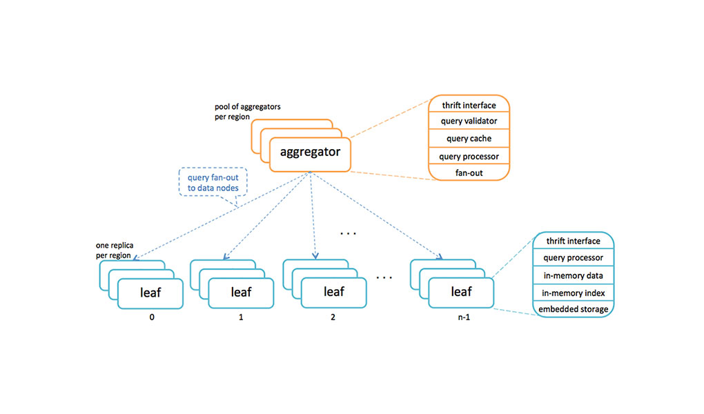

# Mcrouter on Kubernetes #

# Introducing mcrouter: A memcached protocol router for scaling memcached deployments #  

https://engineering.fb.com/web/introducing-mcrouter-a-memcached-protocol-router-for-scaling-memcached-deployments/  

**Mcrouter** является маршрутизатором протокола memcached для масштабирования развертываний **memcached** (http://memcached.org/). Это основной компонент инфраструктуры кеша в **Facebook** и **Instagram**, где **mcrouter** обрабатывает почти **5 миллиардов запросов в секунду**.

Эволюция **cache** от аккуратной оптимизации к необходимости - это общий путь, по которому шли многие крупные компании в масштабах **large web scale**, включая **Facebook**, **Twitter**, **Instagram**, **Reddit** и многие другие.

**Mcrouter** - это маршрутизатор с протоколом memcached, который используется в **Facebook** для обработки всего трафика, поступающего между тысячами серверов кэширования и между ними, в десятках кластеров, распределенных в наших центрах обработки данных по всему миру. Это доказано в широком масштабе - на пике **mcrouter** обрабатывает почти **5 миллиардов запросов в секунду**. Также было доказано, что **Mcrouter** работал как автономный двоичный файл **standalone binary** в настройках **Amazon Web Services**, когда **Instagram** использовал его в прошлом году, прежде чем полностью перейти на инфраструктуру **Facebook**.  

В **Facebook** разработали собственную инфраструктуру для обеспечения бесперебойной работы кеширования. Технология получила название **Mcrouter**, и а ней работники Facebook рассказали на rонференции, которая проходила в **Сан-Франциско**. Был открыт и исходный код программного продукта, что позволило специалистам детально изучить **Mcrouter**.
Технология представляет собой машршрутизатор на базе общеизвестного протокола **memcached**. Как известно, этот протокол может использоваться и в сетях со значительными нагрузками, так что **memcached** без проблем используется в дата-центрах **Facebook**. 

# Исходный код Mcrouter от Facebook #

https://github.com/facebook/mcrouter

# Защита от падения

Само собой, миллиарды пользователей социальной сети генерируют огромное количество информации, в результате чего дата-центры компании бывают очень сильно нагружены. Однако, **Mcrouter** позволяет снизить влияние таких нагрузок, принимая запросы от пользователей, и адресуя их локальным кеш-серверам. У **Mcrouter** три основных задачи: адресация подключений к кешу, распределение активных нагрузок, защита от перегрузок определенных серверов и групп серверов.

Все это позволяет социальной сети работать с высокой продуктивностью. Если кеш-сервер оказывается перегружен, **Mcrouter** перебрасывает запросы пользователей на другие сервера и их группы. Если сервер или группа серверов выходит из строя, то система задействует резервные сервера, которые моментально начинают работу в качестве огсновной машины. Такой же принцип работы сохраняется и для групп серверов, объединенных схожими задачами.

## Программный код Mcrouter

Как уже говорилось выше, разработчики **Facebook** открыли исходный код своего продукта. Это не случайно, поскольку компания является активным сторонником использования продуктов с открытым кодом. **Facebook**, если так можно выразиться, стала центром кристаллизации сообщества компаний, которые продвигают идею использования программных продуктов с открытым кодом в своей работе.

Что касается **Mcrouter**, то одной из функций технологии стало отслеживание связей между отдельными людьми, вкусов пользователей и шаблонов действий пользователей в рамках социальной сети.

Специальный кеш включает имена людей, информацию о связях между ними, а также отдельные объекты, включая медиафайлы, лайки и все прочее. Любая загрузка личной странички ведет к обращению к кешу. **Mcrouter** может обрабатывать около **5 миллиардов подобных действий за секунду**.

## Facebook делится опытом

**Facebook** уже успела дать опробовать технологию **Mcrouter** другим компаниям, включая еще одному известному ресурсу: **Reddit**. Руководство последнего положительно отозвалось о работе **Reddit** на кластере **AWS-серверов**, наблюдая за динамикой общей работы сетевой инфраструктуры, использующей **Reddit**.

Так, у этого ресурса было около 70 машин, используемых в качестве кеш-серверов. При этом **Reddit** использовал и машины, предоставляемые **Amazon**, причем задействованные сервера относились к различным типам

  

**Facebook** - выпускает код **mcrouter** по лицензии **BSD** с открытым исходным кодом. В **Facebook** считают, что это поможет многим сайтам легче масштабироваться, используя знания **Facebook** о крупномасштабных системах в удобном для понимания и удобном для развертывания пакете.

## Reddit также делает ставку на mcrouter  

**Raddit** уже успел протестировать работу **mcrouter** на одном из предоставленных им **AWS кластеров**. Системный администратор **Reddit** Рикки Рамирез по этому поводу сказал: «Использование серверов сайтом изменялось непрерывно на протяжении многих дней, количество используемых серверов составляло от 170 до 300 штук. Также у нас имелось около 70 нод бекэнд кеша с суммарной памятью в 1ТВ. По результатам можно сказать, что в общем система себя оправдала. Слабое место, с которым должен помочь **mcrouter**, — невозможность переключаться на новые типы машин, которые постоянно выдумывает Amazon. Это довольно большая проблема, которая забирает множество времени у инженера-оператора».

После удачного теста, запущенного на одной из групп объединённых серверов, которая производила **4200 операций за секунду**, команда планирует использовать mcrouter на куда более тяжелых нагрузках. Следующая группа поддастся проверке на работоспособность уже при нагрузке в более чем **200 000 операций в секунду**.

Далее инженеры планируют использовать **mcrouter** для получения доступа к новым облачным виртуальным машинам и замещать ими текущие мощности без простоя интернет ресурса. Разгрузка уже задействованных мощностей будет сопряжена с некими сложностями управления инфраструктурой, но Рамирез уверен, что в результате все эти усилия принесут впечатляющий прирост продуктивности этого оборудования.  

<iframe style="width: 700px;height: 400px;" src="https://www.youtube-nocookie.com/embed/EYhcumt8YyI" frameborder="0" allow="accelerometer; autoplay; encrypted-media; gyroscope; picture-in-picture" allowfullscreen></iframe>  

**Rajesh Nishtala** (Раджеш Ништала), инженер в **Facebook** и **Ricky Ramirez** (Рики Рамирес), инженер в **Reddit**. Современные **large scale web** -инфраструктуры в значительной степени зависят от распределенного кэширования (например, **memcached**) для обработки пользовательских запросов. Проблемы, которые решает McRouter, относятся не только к F**acebook**, но и к системам распределенного кэширования** distributed caching systems** в целом. В результате **Instagram** и **Reddit** также приняли **McRouter** в качестве основного **communication layer ** для своих уровней кэша.

**Deploying Memcached on Google Kubernetes Engine**

https://cloud.google.com/solutions/deploying-memcached-on-kubernetes-engine

**Create your Memcached Cluster with McRouter**

https://medium.com/@felipedutratine/create-your-memcached-cluster-with-mcrouter-7bbf015a5898

<iframe style="width: 700px;height: 400px;" src="https://www.youtube-nocookie.com/embed/doLTkF0RUcc" frameborder="0" allow="accelerometer; autoplay; encrypted-media; gyroscope; picture-in-picture" allowfullscreen></iframe>

**Caching infrastructure at Facebook – memcache, TAO, mcrouter - Igor Požgaj, Facebook DORS/CLUC 2015**

<iframe style="width: 700px;height: 400px;" src="https://www.youtube-nocookie.com/embed/e9lTgFO-ZXw" frameborder="0" allow="accelerometer; autoplay; encrypted-media; gyroscope; picture-in-picture" allowfullscreen></iframe>

**Turning Caches into Distributed Systems with mcrouter - Data@Scale**

<iframe style="width: 700px;height: 400px;" src="https://www.youtube-nocookie.com/embed/799TLlhPNYM" frameborder="0" allow="accelerometer; autoplay; encrypted-media; gyroscope; picture-in-picture" allowfullscreen></iframe>

**DevOpsDays Portland, 2016: Dan Young - 5min ignite - McRouter: Over 100 billion Memcache GETs served**
  

