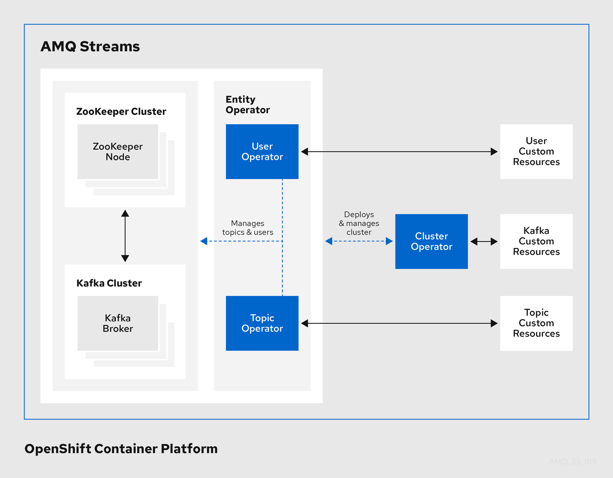

Этот сценарий покажет, как развернуть Apache Kafka и подключиться к нему [Apache Kafka on Kubernetes](https://developers.redhat.com/topics/kafka-kubernetes).

### Что такое Apache Kafka?

[Apache Kafka](https://www.redhat.com/en/topics/integration/what-is-apache-kafka) стала ведущей платформой для создания конвейеров данных в реальном времени. Сегодня Kafka широко используется для разработки приложений, управляемых событиями, где он позволяет сервисам общаться друг с другом посредством событий. Использование Kubernetes для этого типа рабочей нагрузки требует добавления специализированных компонентов, таких как операторы Kubernetes и коннекторы, для подключения остальных ваших систем и приложений к **Kafka ecosystem.**

**Apache Kafka** - это платформа распределенной потоковой передачи данных  **distributed data streaming platform**, которая является популярным выбором для обработки событий. Он может управлять публикацией, подпиской, хранением и обработкой потоков событий в реальном времени **processing event streams in real-time**. Apache Kafka поддерживает ряд сценариев использования, в которых жизненно важны высокая пропускная способность и масштабируемость, и, сводя к минимуму необходимость в **point-to-point integrations** для обмена данными в определенных приложениях, он может уменьшить задержку до миллисекунд **reduce latency to milliseconds**.

### Strimzi: Kubernetes Operator for Apache Kafka

[Strimzi] (https://strimzi.io/) - это проект Sandbox CNCF, который предоставляет ведущим **Operators** сообщества, для деплойя и управления компонентами для запуска кластера Apache Kafka в Kubernetes в различных конфигурациях развертывания. Сюда входят брокеры **Kafka**, **Apache ZooKeeper**, **MirrorMaker** и **Kafka Connect**.

### Red Hat Integration

Чтобы быстро и эффективно реагировать на потребности бизнеса, вам нужен способ интеграции приложений и данных, распределенных по вашему предприятию.  [Red Hat AMQ](https://www.redhat.com/en/technologies/jboss-middleware/amq)  - на основе сообществ с открытым исходным кодом, таких как **Apache ActiveMQ** и **Apache Kafka** - это гибкая платформа обмена сообщениями, которая надежно доставляет **delivers** информацию, позволяя интеграция в реальном времени **real-time integration** и подключение к Интернету вещей (**IoT**).

**AMQ streams**, компонент [Red Hat Integration](https://www.redhat.com/en/products/integration), делают **Apache Kafka** «родным для OpenShift - **OpenShift native**» за счет использования мощных операторов **operators**, которые упрощают развертывание, настройку, управление, и использование Apache Kafka в OpenShift.
