Чтобы запустить **AMQ Streams** & **Jaeger**, вам понадобится доступ к среде **OpenShift 4.5**. Давайте установим основы.

## Вход в кластер через панель управления Dashboard

Кликните на [**Web-Console OpenShift 4.5**](https://console-openshift-console-[[HOST_SUBDOMAIN]]-443-[[KATACODA_HOST]].environments.katacoda.com) tab чтобы открыть панель управления dashboard.

Затем вы сможете войти в систему с правами администратора с помощью:

* **Username:** ``admin``{{copy}}
* **Password:** ``admin``{{copy}}

## Вход в кластер через CLI

Перед созданием любых приложений залогинтесь в системе как **admin**. Это потребуется, если вы хотите войти в веб-консоль и
используй это.

Чтобы залогинется в кластер OpenShift из **_Terminal_** выполните:

``oc login -u admin -p admin``{{execute}}

Это позволит вам войти в систему, используя учетные данные **credentials**:

* **Username:** ``admin``
* **Password:** ``admin``

Используйте те же учетные данные **credentials** для входа в веб-консоль.

## Создание проекта

Начнем с создания нового проекта для этой демонстрации:

``oc new-project istio-system``{{execute}}

### Как установить Service Mesh в OpenShift?

У вас есть два разных способа установить **OpenShift Service Mesh**: с помощью веб-консоли или с помощью интерфейса командной строки.
В этой Сценарии мы будем использовать веб-консоль, но если вы хотите ознакомиться с некоторыми советами и приемами **CLI**, 
я бы порекомендовал вам взглянуть на другие сценарии с **CLI**

**OpenShift Service Mesh** включает в себя несколько частей, включая **ISITO, Jaeger, Kiali, Prometheus** и **Grafana**.

Благодаря **Operators** деплоймент и управление жизненным циклом **lifecycle management (ie. updates)** всех этих различных частей довольно просты, а благодаря **OpenShift Operator Lifecycle Manager** и **Operator Hub** пользовательский интерфейс намного лучше, чем поиск **upstream Operators** и их развертывание вручную.

Давайте посмотрим, как установить **OpenShift Service Mesh**.

### Установите необходимые операторы

В нашем случае в **OpenShift 4.5** (возможно, в будущем это будет упрощено) мы должны будем развернуть **(as cluster-admin user)** некоторые операторы в качестве предварительного требования **pre-requirement** перед установкой оператора **OpenShift Service Mesh**. Если вы хотите получать поддержку, не устанавливайте  **“community”** версии Операторов):

Оставьте параметры, выбранные по умолчанию, во время работы **operators.** Вы можете выбрать **Manual updates**, чтобы быть уверенным, что Оператор не обновит **service**, пока кто-нибудь вручную не запустит обновление, если вы считаете, что это может означать более стабильную среду **stable environment**.

- **Elasticsearch operator**: будет размещать данные **Jaeger**.

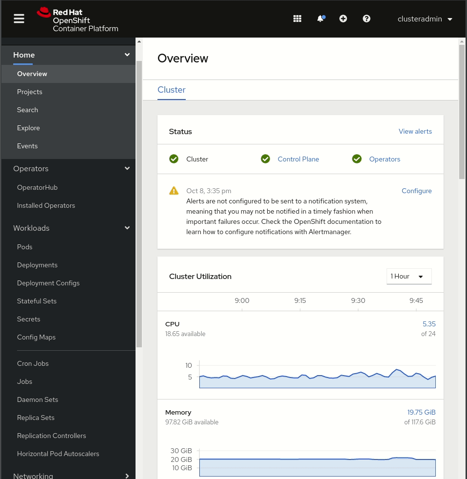

Шаг 1: **Elasticsearch operator**

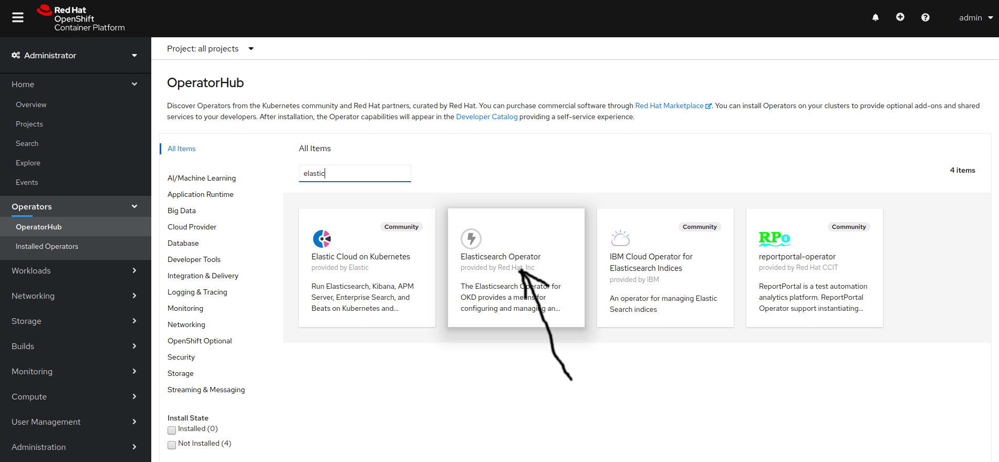

Шаг 2: **Elasticsearch operator**

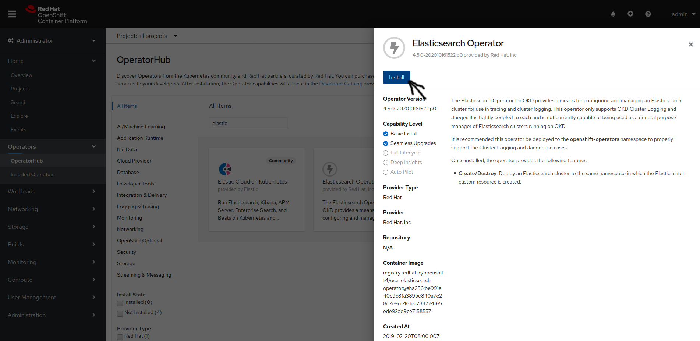

Шаг 3: **Elasticsearch operator**

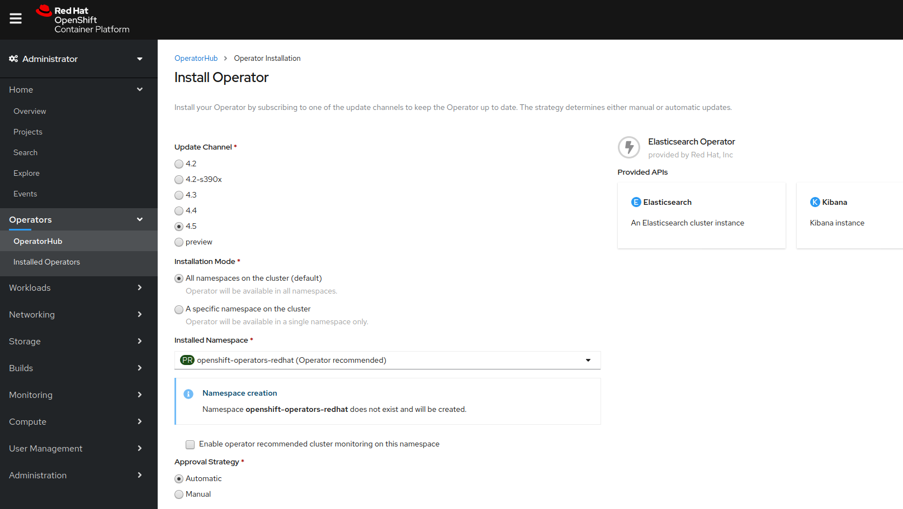

Шаг 4: **Elasticsearch operator**

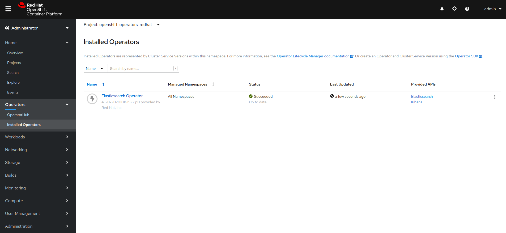

- **Jaeger operator**: обеспечит возможность **tracing capabilities**.

Шаг 1: **Jaeger operator**

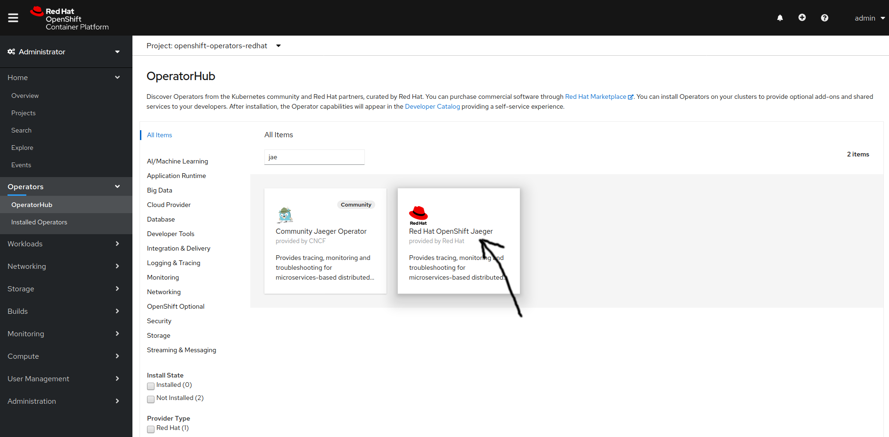

Шаг 2: **Jaeger operator**

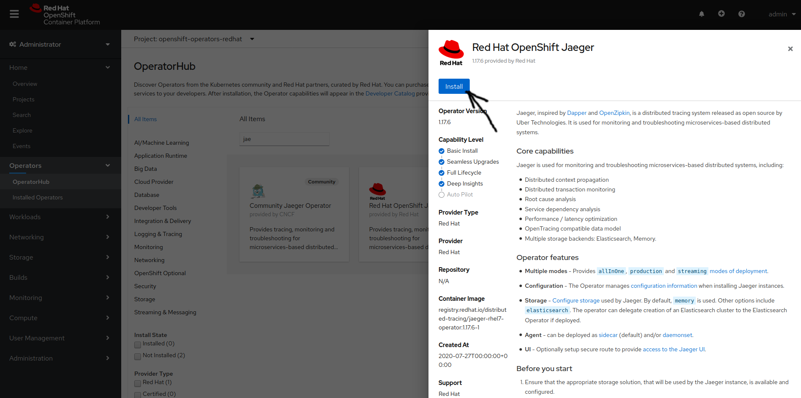

Шаг 3: **Jaeger operator**

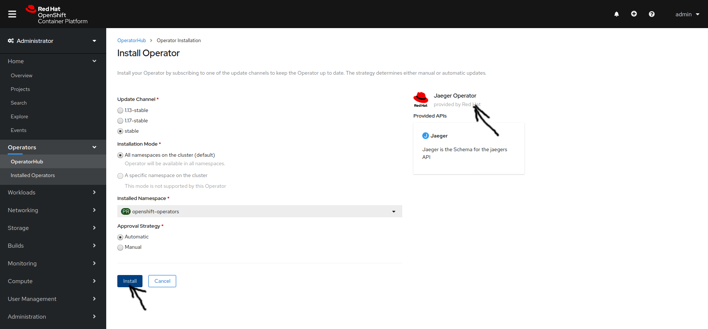

Шаг 4: **Jaeger operator**

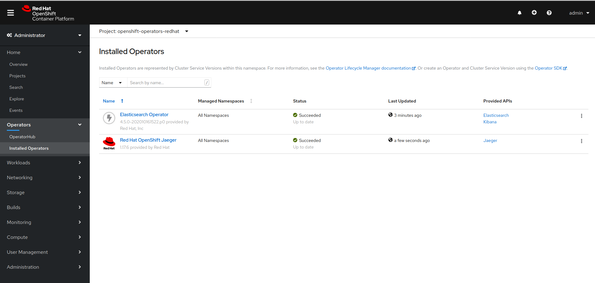

- **Kiali operator**: Предоставляет **Web Console** для системы **ISTIO**.

Шаг 1: **Kiali operator**

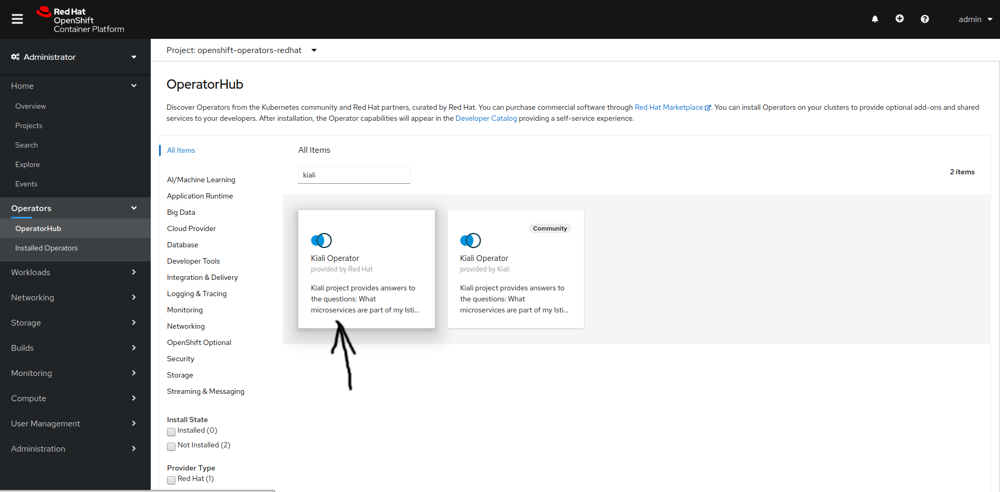

Шаг 2: **Kiali operator**

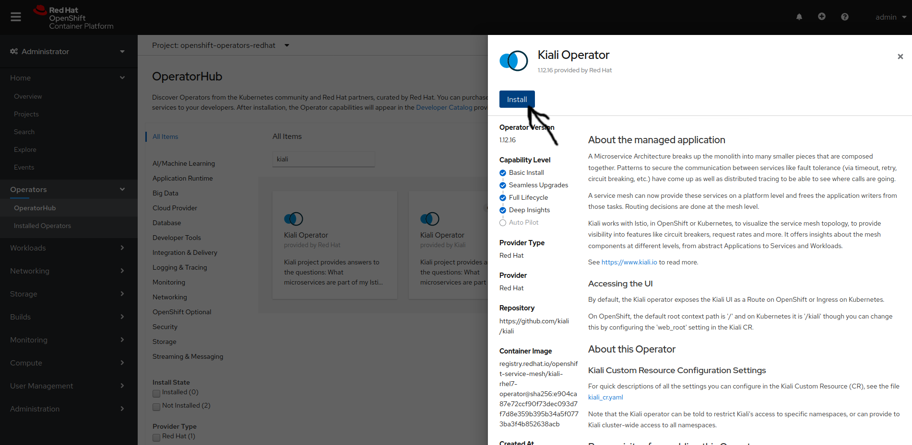

Шаг 3: **Kiali operator**

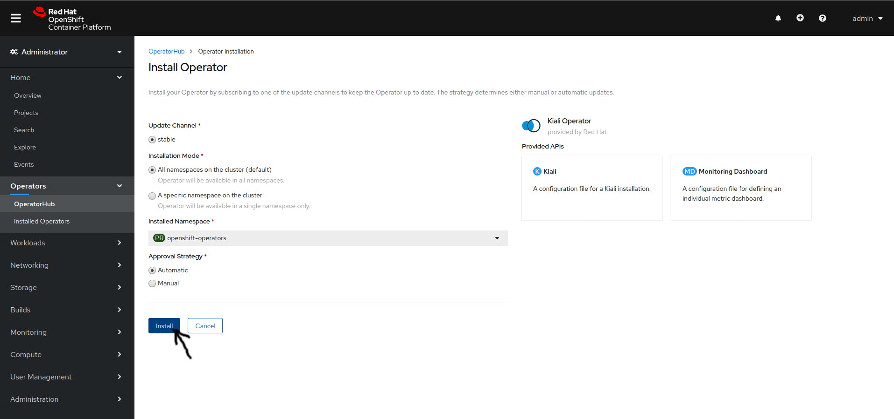

- **operator PODs**: Поскольку операторы должны быть установлены для всех пространств имен, **operator PODs** будут расположены в пространстве имен **“openshift-operators”**, вы можете проверить, были ли они развернуты и работают:

- **OpenShift Service Mesh Operator**: После того, как вы заДеплоили **pre-required operators**, вы можете заДеплиить **OpenShift Service Mesh Operator** (**defaults are OK**):

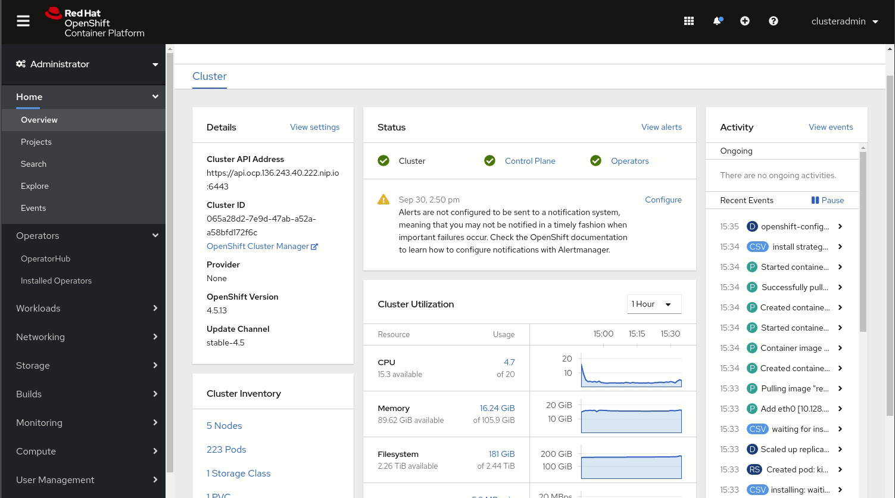

Шаг 1: **Mesh Operator**

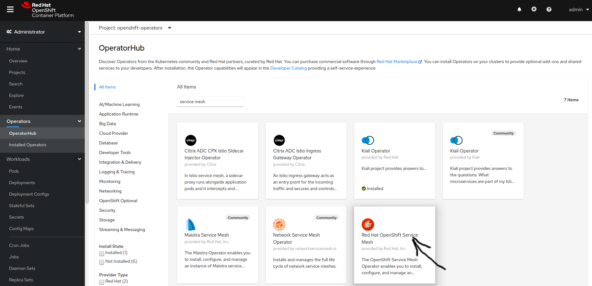

Шаг 2: **Mesh Operator**

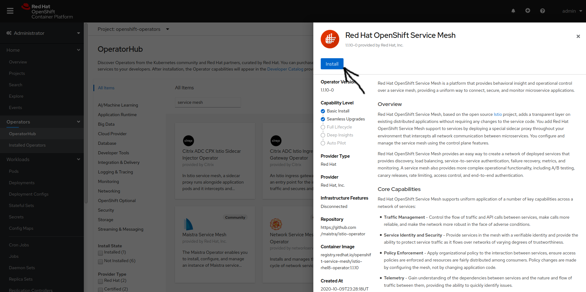

Шаг 3: **Mesh Operator**

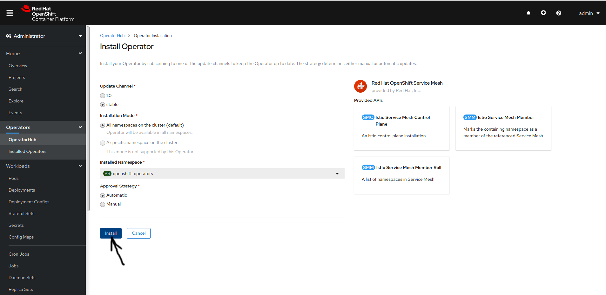

Этот оператор **OpenShift Service Mesh operator** является продуктом проекта **upstream Maistra**. 

### 2. Подготовьте конфигурацию плоскости управления **OpenShift Service Mesh control plane** .

Мы установили **Operators**, но **Operators** не предоставляют Сервисы, которыми они «управляют» сами по себе. 
**Operators** предоставляют **Custom Resource Definitions (CDRs)** , которые расширяют **Kubernetes API** и позволяют легко развернуть **actual service**.

Например, мы заДеплоили **“Jaeger Operator”**, но у нас все еще нет **Jaeger**, работающего в нашем кластере **OpenShift,** 
и мы заДеплоили **Openshift Service Mesh Operator**, но у нас даже нет развернутого компонента плоскости управления **ISTIO control plane**.

У нас есть хорошие новости, вам не придется развертывать **Сервисы** по **service** (**Elasticsearch**, **Jaeger**, **Kiali**, **Prometheus**, **Grafana**, **ISTIO**) 
с помощью их **Operators**, достаточно будет заДеплоить плоскость управления **“Service Mesh”** и все остальное, будет выполнено автоматически.

Перед развертыванием плоскости управления **Service Mesh control plane** необходимо выполнить два предварительных **pre-requisites** требования.

- Во-первых, вам нужно создать проект **OpenShift project (Kubernetes namespace)**, в котором вы будете развертывать **PODs**. 
В большей части документации OpenShift вы обнаружите, что проект называется **“istio-system”**, но вы можете заДеплоить плоскость управления в любом проекте.

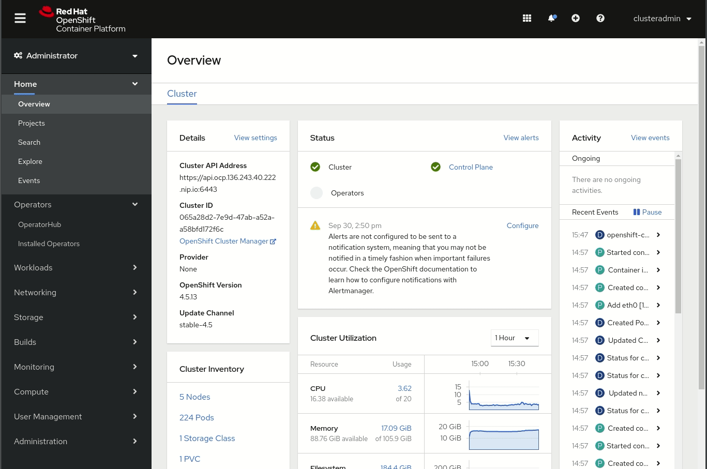

> **Note**: Если вы планируете установить более одной плоскости управления **control plane**, необходимо принять во внимание, что вы можете развернуть только одну плоскость управления **OpenShift Service Mesh** для каждого **пространства имен/проекта**. В наших примерах мы будем использовать две плоскости управления **two control planes**, поэтому я также создал второе пространство имен с именем **istio-system-b** для размещения второй **control plane**.

- Второе предварительное **pre-requisite** условие  - вам нужна конфигурация плоскости управления **Control Plane**.

Когда вы попытаетесь заДеплоить плоскость управления **OpenShift Service Mesh**, вы увидите, что существует объект **ServiceMeshControlPlan** default “basic-install” object (предназначенный для использования в качестве лабораторной, а не производственной среды). Если вы хотите взглянуть на эту конфигурацию, вы можете выполнить шаги установки уровня управления, но… не нажимая кнопку **“Create”**.

Учтите, что если вы это сделаете, вы найдете по умолчанию представление формы **Form** (начиная с **OpenShift 4.5**), которое является простым способом внести некоторые изменения в конфигурацию, но, к сожалению, не отображает все параметры **all options**, поэтому вам нужно будет перейти на представление **YAML**:

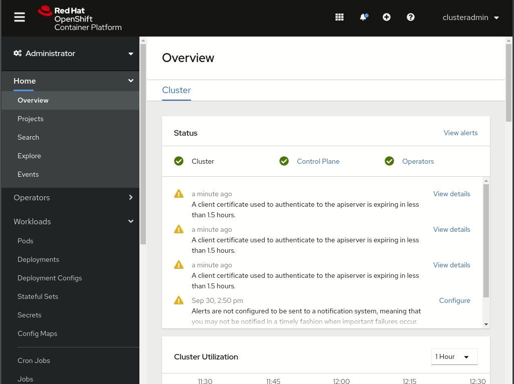

