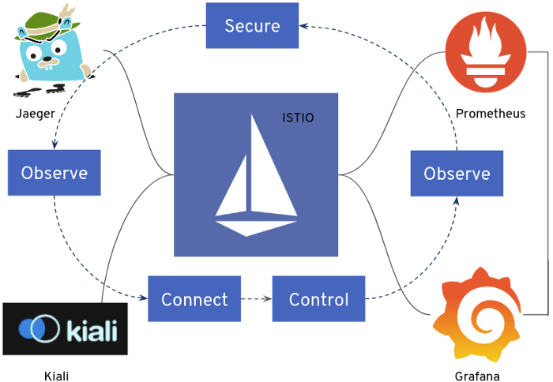
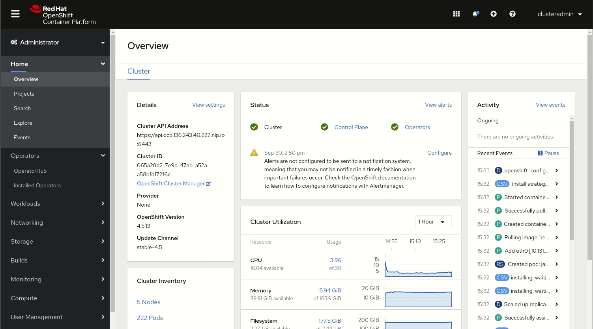
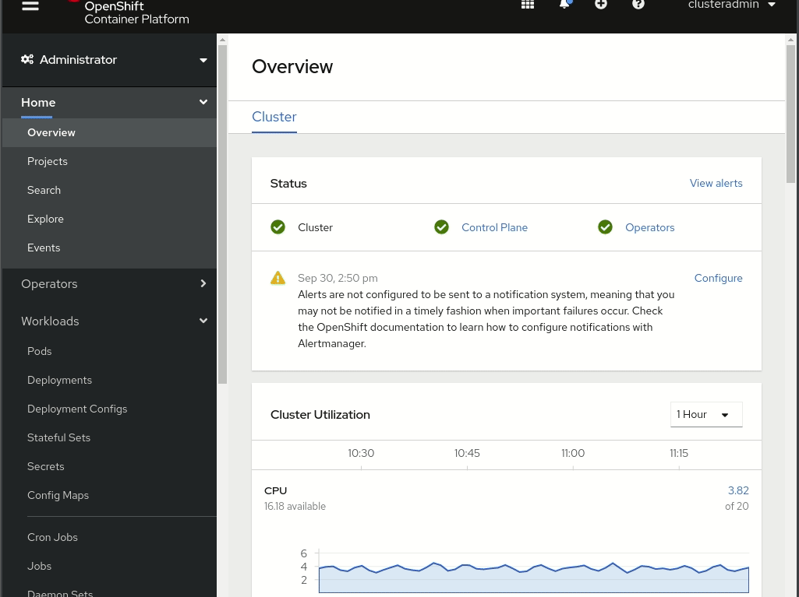
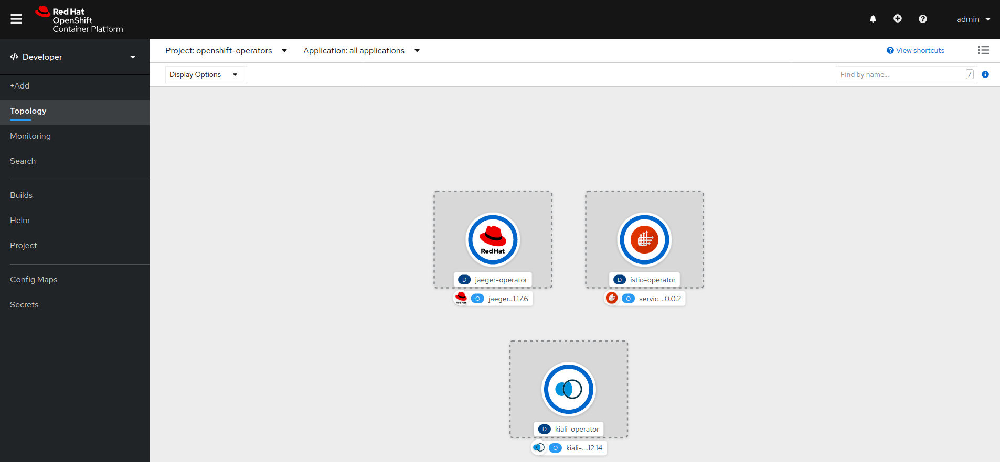
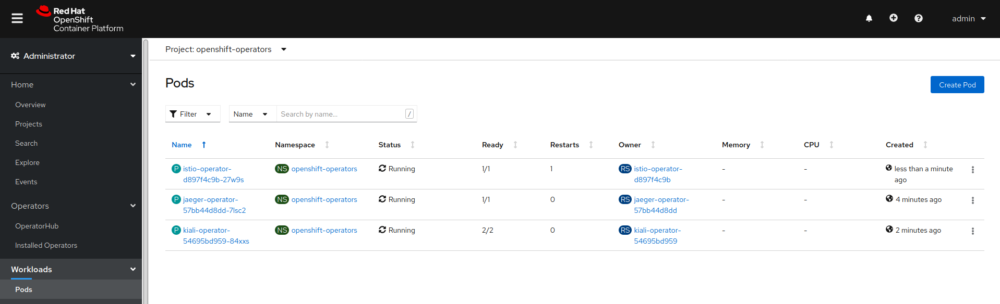

## Вход в кластер через CLI

Перед созданием любых приложений залогинтесь в системе как **admin**. Это потребуется, если вы хотите войти в веб-консоль и
используй это.

Чтобы залогинется в кластер OpenShift из **_Terminal_** выполните:

``oc login -u admin -p admin``{{execute}}

Это позволит вам войти в систему, используя учетные данные **credentials**:

* **Username:** ``admin``
* **Password:** ``admin``

Используйте те же учетные данные **credentials** для входа в веб-консоль.

### Создание проекта

Начнем с создания нового проекта для этой демонстрации:

``oc new-project istio-microservices``{{execute}}

## Вход в кластер через панель управления Dashboard

Кликните на [**Web-Console OpenShift 4.5**](https://console-openshift-console-[[HOST_SUBDOMAIN]]-443-[[KATACODA_HOST]].environments.katacoda.com) tab чтобы открыть панель управления dashboard.

Затем вы сможете войти в систему с правами администратора с помощью:

* **Username:** ``admin``{{copy}}
* **Password:** ``admin``{{copy}}

### Как установить Service Mesh в OpenShift?

У вас есть два разных способа установить **OpenShift Service Mesh**: с помощью веб-консоли или с помощью интерфейса командной строки.
В этой Сценарии мы будем использовать веб-консоль, но если вы хотите ознакомиться с некоторыми советами и приемами **CLI**, 
я бы порекомендовал вам взглянуть на другие сценарии с **CLI**

**OpenShift Service Mesh** включает в себя несколько частей, включая **ISITO, Jaeger, Kiali, Prometheus** и **Grafana**.

Благодаря **Operators** деплоймент и управление жизненным циклом **lifecycle management (ie. updates)** всех этих различных частей довольно просты, а благодаря **OpenShift Operator Lifecycle Manager** и **Operator Hub** пользовательский интерфейс намного лучше, чем поиск **upstream Operators** и их развертывание вручную.

Давайте посмотрим, как установить **OpenShift Service Mesh**.

### Установите необходимые операторы

В нашем случае в **OpenShift 4.5** (возможно, в будущем это будет упрощено) мы должны будем развернуть **(as cluster-admin user)** некоторые операторы в качестве предварительного требования **pre-requirement** перед установкой оператора **OpenShift Service Mesh**. Если вы хотите получать поддержку, не устанавливайте  **“community”** версии Операторов):

Оставьте параметры, выбранные по умолчанию, во время работы **operators.** Вы можете выбрать **Manual updates**, чтобы быть уверенным, что Оператор не обновит **service**, пока кто-нибудь вручную не запустит обновление, если вы считаете, что это может означать более стабильную среду **stable environment**.

- **Jaeger operator**: обеспечит возможность **tracing capabilities**.

- **Kiali operator**: Предоставляет **Web Console** для системы **ISTIO**.

- **operator PODs**: Поскольку операторы должны быть установлены для всех пространств имен, **operator PODs** будут расположены в пространстве имен **“openshift-operators”**, вы можете проверить, были ли они развернуты и работают:

- **OpenShift Service Mesh Operator**: После того, как вы заДеплоили **pre-required operators**, вы можете заДеплиить **OpenShift Service Mesh Operator** (**defaults are OK**):

Этот оператор **OpenShift Service Mesh operator** является продуктом проекта **upstream Maistra**. 

### Топология : установленных операторов 

######################################################

###  Install the MySQL Operator

``oc create ns mysql-operator``{{execute}}

``oc apply -n mysql-operator -f https://raw.githubusercontent.com/mattermost/mattermost-operator/master/docs/mysql-operator/mysql-operator.yaml``{{execute}}

###  Install the MinIO Operator

``oc create ns minio-operator``{{execute}}

``oc apply -n minio-operator -f https://raw.githubusercontent.com/mattermost/mattermost-operator/master/docs/minio-operator/minio-operator.yaml``{{execute}}

### Install the Mattermost Operator

``oc create ns mattermost-operator``{{execute}}

``oc apply -n mattermost-operator -f https://raw.githubusercontent.com/mattermost/mattermost-operator/master/docs/mattermost-operator/mattermost-operator.yaml``{{execute}}

