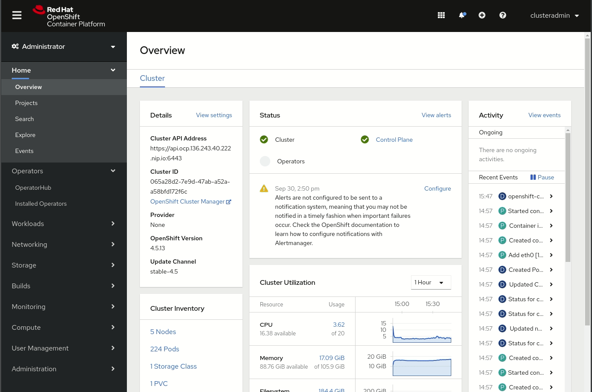
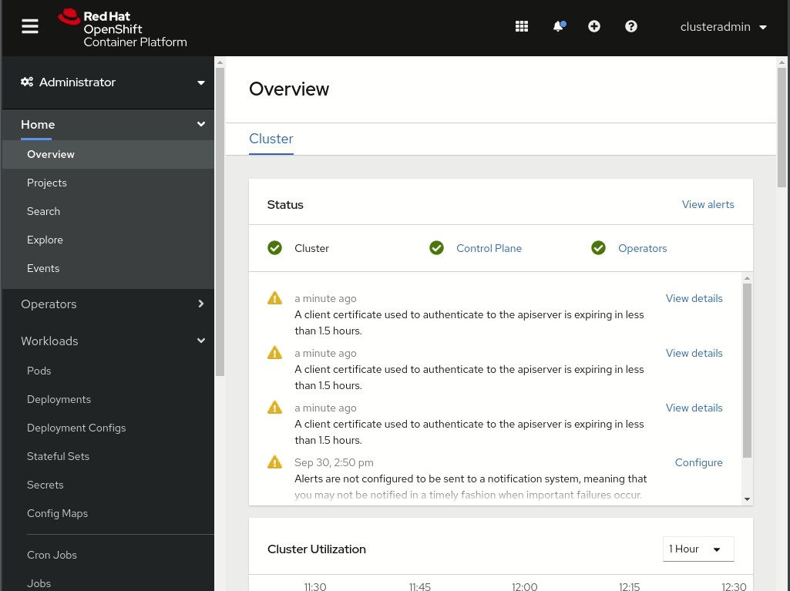
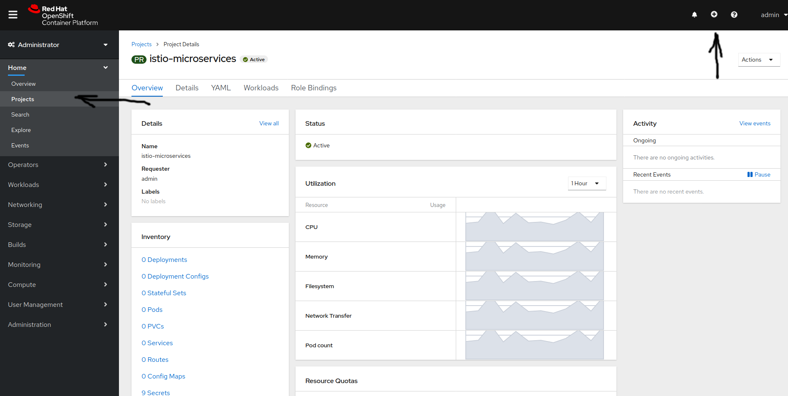
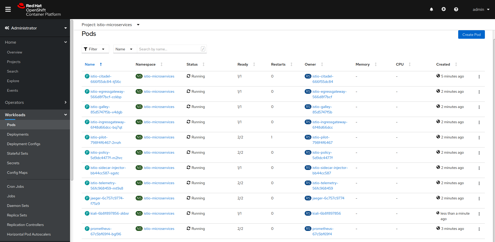
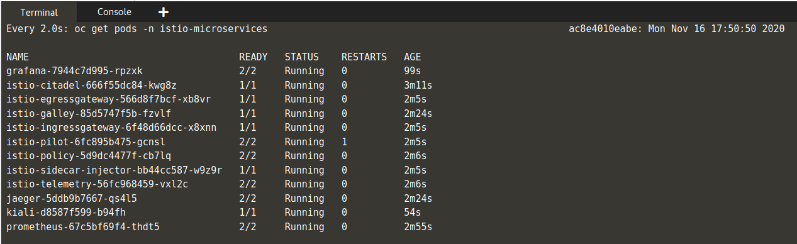

### 2. Подготовьте конфигурацию плоскости управления **OpenShift Service Mesh control plane** .

Мы установили **Operators**, но **Operators** не предоставляют Сервисы, которыми они «управляют» сами по себе. 
**Operators** предоставляют **Custom Resource Definitions (CDRs)** , которые расширяют **Kubernetes API** и позволяют легко развернуть **actual service**.

Например, мы заДеплоили **“Jaeger Operator”**, но у нас все еще нет **Jaeger**, работающего в нашем кластере **OpenShift,** 
и мы заДеплоили **Openshift Service Mesh Operator**, но у нас даже нет развернутого компонента плоскости управления **ISTIO control plane**.

У нас есть хорошие новости, вам не придется развертывать **Сервисы** по **service** (**Elasticsearch**, **Jaeger**, **Kiali**, **Prometheus**, **Grafana**, **ISTIO**) 
с помощью их **Operators**, достаточно будет заДеплоить плоскость управления **“Service Mesh”** и все остальное, будет выполнено автоматически.

Перед развертыванием плоскости управления **Service Mesh control plane** необходимо выполнить два предварительных **pre-requisites** требования.

- Во-первых, вам нужно создать проект **OpenShift project (Kubernetes namespace)**, в котором вы будете развертывать **PODs**. 
В большей части документации OpenShift вы обнаружите, что проект называется **“istio-system”**, но вы можете заДеплоить плоскость управления в любом проекте.



> **Note**: Если вы планируете установить более одной плоскости управления **control plane**, необходимо принять во внимание, что вы можете развернуть только одну плоскость управления **OpenShift Service Mesh** для каждого **пространства имен/проекта**. В наших примерах мы будем использовать две плоскости управления **two control planes**, поэтому я также создал второе пространство имен с именем **istio-system-b** для размещения второй **control plane**.

- Второе предварительное **pre-requisite** условие  - вам нужна конфигурация плоскости управления **Control Plane**.

Когда вы попытаетесь заДеплоить плоскость управления **OpenShift Service Mesh**, вы увидите, что существует объект **ServiceMeshControlPlan** default “basic-install” object (предназначенный для использования в качестве лабораторной, а не производственной среды). Если вы хотите взглянуть на эту конфигурацию, вы можете выполнить шаги установки уровня управления, но… не нажимая кнопку **“Create”**.

Учтите, что если вы это сделаете, вы найдете по умолчанию представление формы **Form** (начиная с **OpenShift 4.5**), которое является простым способом внести некоторые изменения в конфигурацию, но, к сожалению, не отображает все параметры **all options**, поэтому вам нужно будет перейти на представление **YAML**:




```
apiVersion: maistra.io/v2
kind: ServiceMeshControlPlane
metadata:
  name: controlplane-microservices
  namespace: istio-microservices
spec:
  version: v1.1
  istio:
    global:
      disablePolicyChecks: false
      mtls:
        enabled: false
    gateways:
      istio-egressgateway:
        autoscaleEnabled: false
      istio-ingressgateway:
        autoscaleEnabled: false
        ior_enabled: false
    mixer:
      policy:
        autoscaleEnabled: false
      telemetry:
        autoscaleEnabled: false
    pilot:
      autoscaleEnabled: false
      traceSampling: 100  
    kiali:
      enabled: true
      dashboard:
        viewOnlyMode: false
    grafana:
      enabled: false
    tracing:
      ingress:
        enabled: true
      jaeger:
        template: all-in-one
```
Добавим конфигурация для ControlPlane с помощью Yaml-файла



Ждем пока добавятся Поды



### Пример от Google с 10 микросервисами

Клонируем с github примеры от Google для создания 10 микросервисов, внутри Istio, gRPC и OpenCensus.

``git clone https://github.com/gridgentoo/microservices-demo.git``{{execute}}

``cd microservices-demo``{{execute}}

``watch oc get pods -n istio-microservices``{{execute}}



Установим манифест

``oc apply -f ./release/kubernetes-manifests.yaml``{{execute}}

``oc apply -f ./release/istio-manifests.yaml``{{execute}}

