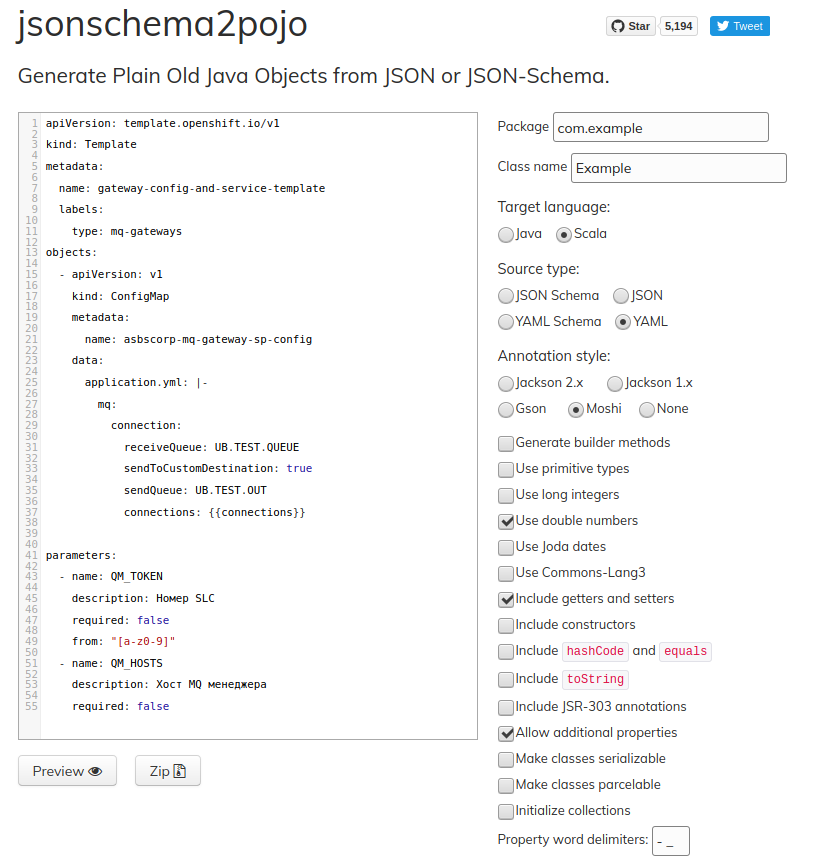

Затем создадим простой скрипт-конвертор и сохраним его под именем **json2yaml.py**. 
Этот скрипт импортирует оба модуля — **YAML** и **JSON Python**, а также загружает указанный пользователем файл **JSON**, 
выполняет конвертирование и пишет данные в файл **output.yaml**, в нашем случае выводить будем в **configmap2.yaml**.

### Конвертор **json2yaml**.

создадим файл **json2yaml.py**:
`vi json2yaml.py`{{execute T1}}

```yaml
#!/usr/bin/python3
import yaml
import sys
import json

OUT=open('configmap2.yaml','w')
IN=open(sys.argv[1], 'r')

JSON = json.load(IN)
IN.close()
yaml.dump(JSON, OUT)
OUT.close()
```

`python3 json2yaml.py configmap.json`{{execute T1}}


После применения скриптов, на **Выходе** получим **configmap.yaml**

`vi configmap2.yaml`{{execute T1}}

#########################################################

AirFlow Kubernetes Operator в Bloomberg

https://docs.google.com/presentation/d/12-dyJB6bd2RumpexzoOBCiaVzpqyWmTmKYXCttZPPt0/


<iframe style="width: 700px;height: 400px;" src="https://www.youtube-nocookie.com/embed/VrsVbuo4ENE" frameborder="0" allow="accelerometer; autoplay; encrypted-media; gyroscope; picture-in-picture" allowfullscreen></iframe>

**Bloomberg :: Airflow on Kubernetes: Dynamic Workflows Simplified - Daniel Imberman, Bloomberg & Barni Seetharaman**

###########################################################

Kubeflow Pipelines API использует JSON

https://www.kubeflow.org/docs/pipelines/reference/api/kubeflow-pipeline-api-spec/

#########################################################

[_Airflow  for Enterprise Architect] Реверс инжениринг Airflow для Kubernetes. Исходный код и UML-диаграмма классов
https://drive.google.com/drive/folders/1U_H8FNM3gpRBf_r1cUSuCbXzgTivpXyO

###########################################################
######   Как описать 100 Gitlab джоб в 100 строк на Jsonnet
######   на следующем Шаге 
######   https://habr.com/ru/post/483626/
###########################################################


**(Financial-Times (Jenkins-PipeLine))**

https://github.com/gridgentoo/Financial-Times-Jenkins

###########################################################

**(SAP(Jenkins-PipeLine))** 
https://github.com/gridgentoo/SAP-jenkins-library

############################################################

**(Bloomberg(Jenkins-PipeLine-Cookbook))**
https://github.com/gridgentoo/bloomberg-jenkins-cluster-cookbook

############################################################

######   О Кодогенерации из JSON & YAML кода на (Scala) для Kubernetes
######   на следующем Шаге 
###########################################################



Кодогенерация в Uber

https://docs.google.com/document/d/1NHeGZ45bLLbOmdoLBQ3f8VFqU0NVtJYSxpNGMwBfZqc/


