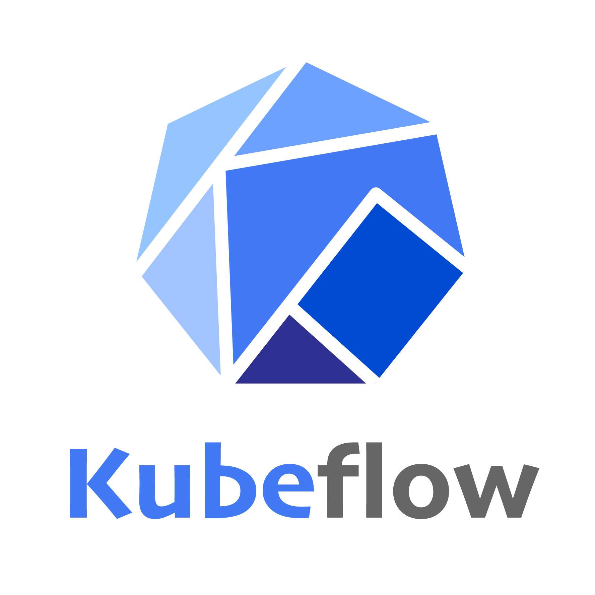

# Conclusion #

Kubeflow is an open, community driven project to make it easy to deploy and manage an Machine Learning stack on Kubernetes.

This scenario is in the process of drafting. However, you will see that a functional Kubeflow instance will be running and is open to experimentation. If you know Kubeflow, your feedback to support@katacoda.com and jonathan.johnson@dijure.com would be helpful.

## Lessons Learned ##

With these steps you have learned:

- &#x2714; how to ...
- &#x2714; how to ...
- &#x2714; how to ...

## References ##

- [Kubeflow](https://www.kubeflow.org/)
- [Barbara Fusinska](https://www.altoros.com/blog/kubeflow-automating-deployment-of-tensorflow-models-on-kubernetes/)
- [Kubectl Cheat Sheet](https://kubernetes.io/docs/reference/kubectl/cheatsheet/)

------

For a deeper understanding of these topics and more join  [Jonathan Johnson](http://www.dijure.com)  at various conferences, symposiums, workshops, and meetups.
  
<b>Software Architectures ★ Speaker ★ Workshop Hosting ★ Kubernetes & Java Specialist</b>

