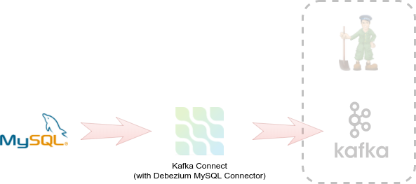
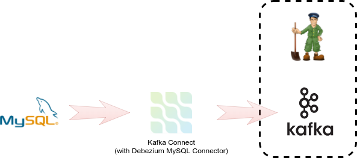

Новый проект под названием `debezium` подготовлен с необходимыми ресурсами, необходимыми для выполнения развертывания. 
В **home directory**, самом проекте или в OpenShift созданы несколько ресурсов.
* установленная версия [release 0.14.0](https://github.com/strimzi/strimzi-kafka-operator/releases/tag/0.14.0) оператора [Strimzi](http://strimzi.io) проекта **Kafka operator**
* **Strimzi Cluster Operator** управляющий Kafka брокерами
* Экземпляр MySQL, содержащий небольшой набор данных для потоковой передачи **streamed**
* **templates** шаблоны, используемые для развертывания компонентов

**1. Выполните следующие команды, чтобы переключиться на проект `debezium` и изучить его.**

> Если вы нажимаете **click** на команду, она автоматически копируется в терминал и выполняется **executed**

Переключиться на проект **debezium**

``oc project debezium``{{execute}}

**Check** - убедитесь, что экземпляр MySQL запущен

``oc get pods``{{execute}}

and that it is exposed as a service

``oc get svc``{{execute}}

**diagram of deployment** - диаграмма развертывания теперь выглядит так

**2. Разверните Kafka брокер с ZooKeeper.**

Первый компонент для развертывания - это брокер Kafka.

Эта задача делегирована шаблонам [templates](https://github.com/strimzi/strimzi/tree/0.2.0/examples/templates/cluster-controller) и Cluster Controller, 
предоставленным проектом [Strimzi](http://strimzi.io/). Шаблоны **templates** уже присутствуют в **home directory** в клонированном репозитории.

The templates by default deploy Kafka broker and ZooKeeper in a high-available configuration with replication factor `3`.
This is not necessary in the development environment so we reduce the number of nodes and replication factor for system topics to `1`.

Шаблоны **templates** по умолчанию развертывают Kafka broker и ZooKeeper в конфигурации с высокой доступностью **high-available** с коэффициентом **replication factor** `3`.
 Это не является необходимым в среде разработки, поэтому мы уменьшаем количество **nodes**  и коэффициент **replication factor** для системных **topics** до 1.

Мы также развернем **ephemeral** вариант брокера.   
Вы должны использовать **persistent** вариант в **production**.  

Чтобы развернуть брокера, введите команду

``oc new-app strimzi-ephemeral -p ZOOKEEPER_NODE_COUNT=1 -p KAFKA_NODE_COUNT=1 -p KAFKA_OFFSETS_TOPIC_REPLICATION_FACTOR=1 -p KAFKA_TRANSACTION_STATE_LOG_REPLICATION_FACTOR=1
``{{execute}}

Теперь давайте подождем, пока будут развернуты оба **ZooKeeper** и **Kafka broker**  

``oc get pods -w``{{execute}}

Окончательный список **pods** должен быть похож на

    NAME                                          READY     STATUS    RESTARTS   AGE
    my-cluster-entity-operator-798b74565c-bkjwh   3/3       Running   1          32s
    my-cluster-kafka-0                            2/2       Running   0          1m
    my-cluster-zookeeper-0                        2/2       Running   0          1m
    mysql-1-w7shk                                 1/1       Running   0          9m
    strimzi-cluster-operator-5658b55c84-89mf5     1/1       Running   0          9m

> Примечание: **Kafka** зависит от **ZooKeeper**, поэтому ожидаются периодические **Kafka failures** так как ZooKeeper может не инициализироваться во время запуска Kafka.  

Доступны новые **services**  

``oc get svc -l app=strimzi-ephemeral``{{execute}}

    NAME                          TYPE        CLUSTER-IP      EXTERNAL-IP   PORT(S)                      AGE
    my-cluster-kafka-bootstrap    ClusterIP   172.30.136.36   <none>        9091/TCP,9092/TCP,9093/TCP   2m
    my-cluster-kafka-brokers      ClusterIP   None            <none>        9091/TCP,9092/TCP,9093/TCP   2m
    my-cluster-zookeeper-client   ClusterIP   172.30.82.207   <none>        2181/TCP                     3m
    my-cluster-zookeeper-nodes    ClusterIP   None            <none>        2181/TCP,2888/TCP,3888/TCP   3m

**3. Verify the broker is up and running.**

> Note: The complete initialization of all components can take a couple of minutes. Please make sure that all pods are in *Running* state and are *Ready* before you try the next steps.

A successful attempt to send a message to (no output expected here)

``echo "Hello world" | oc exec -i -c kafka my-cluster-kafka-0 -- /opt/kafka/bin/kafka-console-producer.sh --broker-list localhost:9092 --topic test``{{execute}}

and receive a message from

``oc exec -c kafka my-cluster-kafka-0 -- /opt/kafka/bin/kafka-console-consumer.sh --bootstrap-server localhost:9092 --topic test --from-beginning --max-messages 1``{{execute}}

the deployed broker indicates that it is available.

## Congratulations

You have now successfully executed the first step in this scenario. 

You have successfully deployed Kafka broker service and made it available to clients to produce and consume messages.

In the next step of this scenario, we will deploy a single instance of Debezium.
