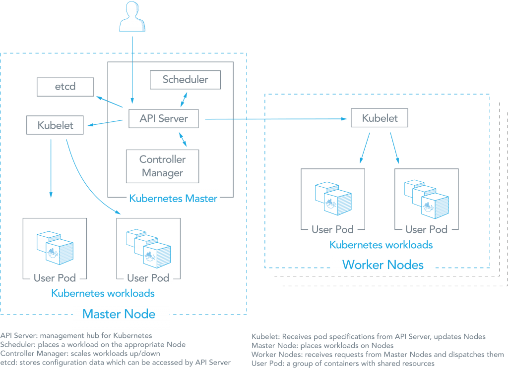
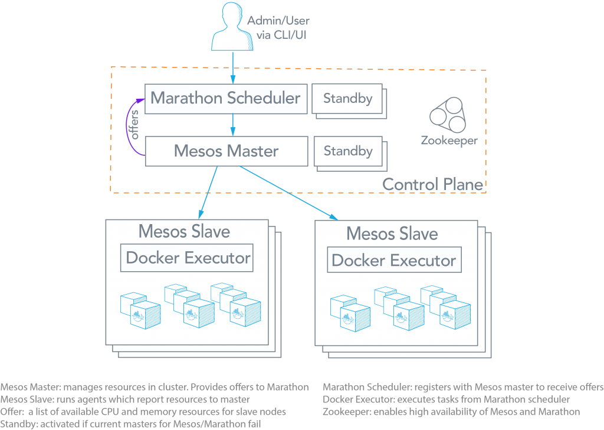

[Portworx](https://portworx.com/) - это программно-определяемое решение для постоянного хранения **persistent storage**,  и специально созданный для приложений, развернутых в виде контейнеров, через оркестровщики контейнеров **container orchestrators**, такие как **Kubernetes**, **Marathon** и **Swarm**. Это решение для кластерного хранения блоков **clustered block storage**  и обеспечивает уровень **Cloud-Native**, из которого контейнеризованные приложения с сохранением состояния **containerized stateful** программно используют сервисы хранения блоков **consume block**, файлов и **object storage services** непосредственно через планировщик **scheduler**.

## **Kubernetes** vs (**Mesos** + **Marathon**)

Ниже сравним **Kubernetes** с решением для оркестровки контейнеров **Mesos + Marathon**. 

Обзор **Kubernetes**

Согласно веб-сайту **Kubernetes**, «**Kubernetes** - это система с открытым исходным кодом для автоматизации **deployment**, **scaling**, и управления контейнерными приложениями». **Kubernetes** был создан **Google** на основе их опыта запуска контейнеров в производстве с использованием внутренней системы управления кластерами под названием **Borg** (иногда ее называют **Omega**). Архитектура для **Kubernetes**, которая опирается на этот опыт, показана ниже:

Как видно из рисунка выше, существует ряд компонентов, ассоциированных с кластером **Kubernetes**. **Master node** помещает рабочие нагрузки контейнера в **user pods** на **worker nodes** или на себя. Другие компоненты включают в себя:

- **etcd**: Этот компонент хранит данные конфигурации **configuration data**, к которым может обращаться **Kubernetes master’s API Server** через простой **HTTP** или **JSON API**.
- **API Server**: Этот компонент является центром управления для **Kubernetes master node**. Это облегчает связь между различными компонентами, тем самым поддерживая работоспособность кластера **cluster health**.
- **Controller Manager**: Этот компонент обеспечивает соответствие желаемого состояния кластеров текущему состоянию путем масштабирования рабочих нагрузок **scaling workloads** вверх и вниз.
- **Scheduler**: этот компонент размещает **workload** на соответствующих нодах
- **Kubelet**: этот компонент получает спецификации модулей от **API Server** и управляет **pods**, запущенными на хосте.

## Обзор  (**Mesos** + **Marathon**)

Из этого руководства вы узнаете, как развернуть **3 node Portworx Cluster**.
