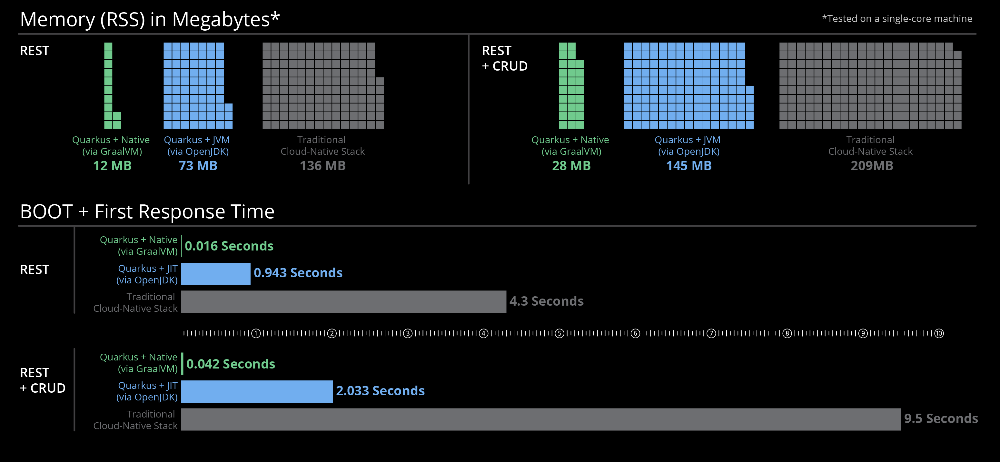
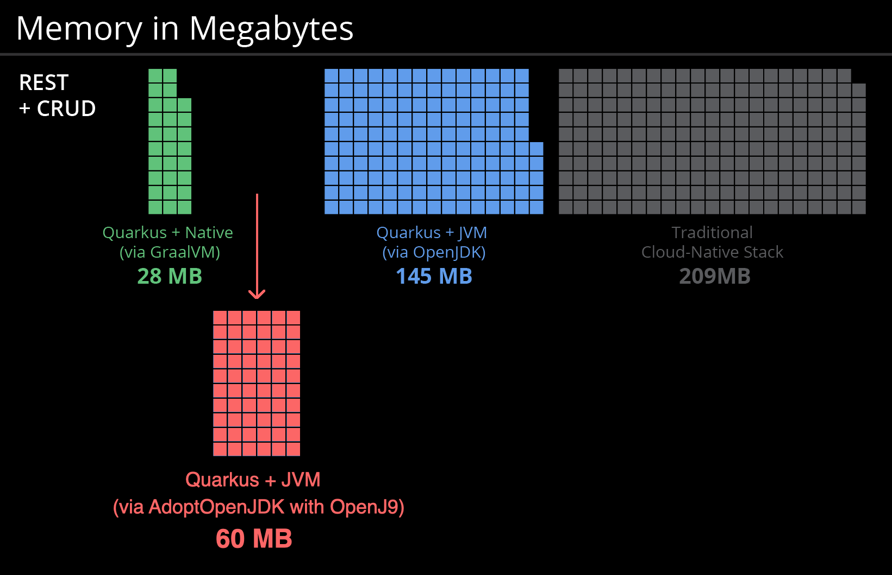

В этом сценарии вы познакомитесь с [Quarkus](https://quarkus.io).

## Что такое Quarkus?

### Supersonic, Subatomic Java

**Quarkus** адаптирует ваше приложение для **GraalVM** и **HotSpot**. 
Удивительно быстрое время загрузки, невероятно низкий объем **low RSS memory** (а не только размера кучи **heap size!**), Обеспечивающий почти мгновенное увеличение масштаба **scale** и высокую плотность использования памяти **high density memory utilization** на платформах оркестровки контейнеров, таких как Kubernetes. Мы используем технику, которую мы называем загрузкой во время компиляции. 
 
   

  

**Quarkus: Supersonic Subatomic Java.**    
https://github.com/quarkusio/quarkus  

В течение многих лет **client-server architecture** была стандартом де-факто для создания приложений. Но произошел серьезный сдвиг.
The _one model rules them all_ age is over. Появился новый диапазон приложений и архитектурных стилей, которые влияют на то, как пишется код, а также на развертывание и выполнение приложений. **HTTP microservices**, **reactive applications**, **message-driven microservices**, и **serverless** теперь являются центральными игроками в современных системах.

**Quarkus** был разработан с учетом этого нового мира и обеспечивает первоклассную поддержку для этих различных парадигм. Модель разработки **Quarkus** трансформируется для адаптации к типу разрабатываемого вами приложения.

**Quarkus** - это **Kubernetes Native Java stack**, созданный специально для **GraalVM** и **OpenJDK HotSpot**, созданный на основе лучших в своем классе библиотек и стандартов Java. Удивительно быстрое время загрузки, невероятно низкий объем **low RSS memory (not just heap size!)**, Обеспечивающий почти мгновенное увеличение масштаба **scale** и **high density memory utilization** высокую плотность использования памяти на платформах оркестровки контейнеров, таких как **Kubernetes**. **Quarkus** использует технику, называемую загрузкой во время компиляции.
[Learn more](https://quarkus.io/vision/container-first).

### Объединяет **Imperative style** и **Reactive style**

Требования **requirements** к заявкам сильно изменились за последние несколько лет. Для любого приложения, чтобы преуспеть в эпоху **cloud computing**, **big data** или **IoT**, **reactive style** становится все более и более подходящим архитектурным стилем.

**Quarkus** сочетает в себе привычный **imperative code** и **non-blocking reactive style** при разработке приложений.

### Функции как Service и Serverless

Вы можете использовать любые функции **Quarkus** в своей функции и получать выгоду от быстрого запуска и низкого использования памяти **low memory utilization.** С **Quarkus** вы можете охватить этот новый мир без необходимости менять язык программирования.

Благодаря их **stellar startup** запуска и низкому использованию памяти **low memory usage** вы можете реализовать функции с использованием Quarkus для использования в **serverless** средах, таких как **AWS Lambda**. Вы можете использовать любые функции **Quarkus** в своей функции и получать выгоду от быстрого запуска и **low memory utilization**. С Quarkus вы можете охватить этот новый мир без необходимости менять язык программирования.

### Developer Joy
**Quarkus** предоставляет единую платформу для оптимизированной **developer joy**:

* Единая конфигурация
* **Zero config**, **live reload ** - живая перезагрузка в мгновение ок
* Streamlined code for the 80% common usages, flexible for the 20%
* No hassle native executable generation

### Другие возможности

Узнайте больше на [quarkus.io](https://quarkus.io) или просто поезжайте и получите практический опыт!